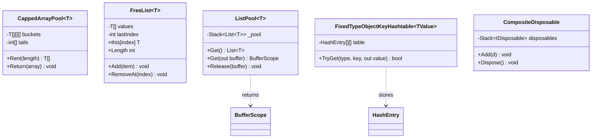
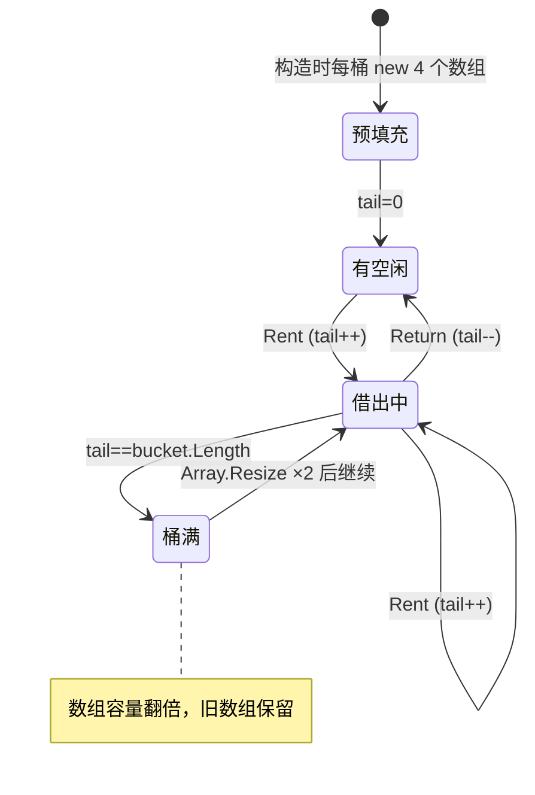
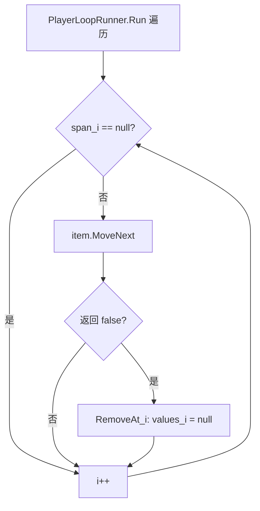

# M1 内存复用与数据结构底座 · 解析

> 坐标：依赖深度最深的底座，被 M2~M7 直接或间接依赖；自身零外部依赖（仅 BCL + 可选 Unity 不安全工具）。
> 本模块的存在理由只有一个：**让「注册一次、解析无数次」的热路径不产生 GC，且容器构建后查表是 O(1)**。

---

## 一、契约定义

### 核心类型清单

| 文件 | 角色 | 可见性 | 被谁用 |
|---|---|---|---|
| `CappedArrayPool<T>` | 按长度分桶的数组对象池（栈式租借） | `internal sealed` | `ReflectionInjector`（构造/方法参数数组）、`ContainerLocalInstanceProvider` |
| `FreeList<T>` | 带空洞、可迭代安全增删的引用数组 | `internal class` | 仅 `PlayerLoopRunner.runners` |
| `ListPool<T>` | `List<T>` 复用池 + `using` 作用域回收 | `internal static` | `CollectionInstanceProvider`、`InjectGameObject`、`LifetimeScope.Find/Awake 调度` |
| `FixedTypeObjectKeyHashtable<TValue>` | 构建期一次性填充的只读哈希表，键 `(Type, object)` | `internal sealed` | `Registry` 的唯一查表后端 |
| `TypeKeyHashTable2<TValue>` | Robin Hood 开放寻址哈希表，键 `Type` | `internal sealed` | **当前运行时无调用点**（见下方约束 5） |
| `CompositeDisposable` | LIFO 释放栈 | `internal sealed` | `Container`/`ScopedContainer`/`EntryPointDispatcher` |
| `RuntimeTypeCache` | 反射派生类型（开放泛型/数组/IEnumerable）的缓存 | `internal static` | `Registry`、各 Provider |

### 穿透语法的关键设计约束

1. **CappedArrayPool 是「按长度精确分桶 + 栈顶指针」而非通用池**：`buckets[i]` 专门存放长度 `i+1` 的数组，`tails[i]` 是该桶已借出数量。`Rent(len)` 永远返回**恰好 `len` 长**的数组（不像 `ArrayPool` 返回 ≥len）。这是因为它服务于反射 `MethodInfo.Invoke(args)`——参数数组长度必须精确匹配。超过 `maxLength`(=8) 的长度直接 `new`，不入池（"Not supported"）。
2. **CappedArrayPool 不校验归还来源**：`Return` 只按 `array.Length` 找桶、`Array.Clear` 清引用、`tails[i]--`。它**不记录哪个数组借给了谁**，只维护"借出计数"。因此「借 A 还 B」也能工作——这是用 unsafe 性能换正确性边界的极简设计（见 02 取舍）。
3. **FreeList 的核心不变量是「索引稳定」**：`Add` 优先复用 null 空洞、`RemoveAt(i)` 只把 `values[i]=null` 不搬移后续元素。因此**遍历期间删除当前项是安全的**——遍历者按 index 走，删除只在原位留下 null，遍历循环显式跳过 null。`lastIndex` 是「最后一个非空索引」的缓存，删尾时回退扫描。
4. **FixedTypeObjectKeyHashtable 是"冻结后只读"**：构造函数一次性吃进全部 `(Type,object)->Value`，容量取 `values.Length/0.75` 向上取 2 的幂，冲突用「数组追加扩容」拉链（每冲突一次 `Array.Copy` 复制整桶+1）。构建后**没有任何写 API**，只有 `TryGet`。查表用 `RuntimeHelpers.GetHashCode(type)`（引用哈希，绕过用户重写的 `GetHashCode`）。
5. **TypeKeyHashTable2 在当前代码中是「死代码 / 备选实现」**：全仓库 grep 仅命中其自身定义，`Registry` 用的是 `FixedTypeObjectKeyHashtable`。它实现了更高级的 Robin Hood 开放寻址（`DistAndFingerPrint` 高 3 字节存探测距离 PSL、低 1 字节存指纹），插入时做"劫富济贫"位移。**保留它有学习价值，但勿误以为它在解析热路径上**——此结论由 grep 验证。

### Mermaid 类图

---

## 二、生命周期与内存

### 动词语义表

| 操作 | 做什么 | 分配? | 释放? |
|---|---|---|---|
| `CappedArrayPool.Rent(n)` | 取 `buckets[n-1][tail]`，空则 `new T[n]`，`tail++` | 仅冷启动/桶耗尽时分配 | 否 |
| `CappedArrayPool.Return(a)` | `Array.Clear(a)` 清引用 + `tail--` | 否 | 逻辑归还（数组对象仍存活复用） |
| `FreeList.Add(x)` | 找 null 槽填入；满则 ×1.5 扩容 | 仅扩容时 | 否 |
| `FreeList.RemoveAt(i)` | `values[i]=null`；删尾时回退 `lastIndex` | 否 | 解引用（不缩容） |
| `ListPool.Get()` | 弹出复用或 `new List(32)` | 仅池空时 | 否 |
| `ListPool.Release(b)` | `b.Clear()` 后压回池 | 否 | 逻辑归还 |
| `BufferScope.Dispose()` | 自动调用 `Release` | 否 | 逻辑归还 |
| `FixedTypeObjectKeyHashtable` 构造 | 一次性建表 + 拉链 | 大量（仅构建期一次） | 否 |
| `CompositeDisposable.Dispose()` | LIFO 弹栈逐个 `Dispose` | 否 | 真实释放 |

### CappedArrayPool 状态机（单个长度桶的 tail 指针）

### FreeList「迭代安全删除」关键流程

> 关键：遍历用的是固定快照长度 `span.Length`，删除只在原位置 null 化，**不触发数组搬移**，所以同帧内删除不会打乱后续索引。这是 PlayerLoop 每帧可安全注销 tickable 的根基（M6 复用此不变量）。

---

## 三、跨层桥接

- **M1→M2**：`ReflectionInjector` 在 `CreateInstance`/`InjectMethods` 中 `Rent` 一个参数数组、填入解析结果、`MethodInfo.Invoke`、`finally` 中 `Return`。这是热路径零 GC 的关键注入点。
- **M1→M3**：`Registry.Build` 把所有 `(Type,object)→Registration` 灌入 `FixedTypeObjectKeyHashtable`；`RuntimeTypeCache` 把 `IEnumerable<T>`/`T[]`/开放泛型等派生类型缓存下来，供集合解析与开放泛型回退使用。
- **M1→M4**：`Container`/`ScopedContainer` 各持有一个 `CompositeDisposable`，解析单例/Scoped 时把实现了 `IDisposable` 的实例压栈，容器释放时 LIFO 逐个释放。
- **M1→M6**：`PlayerLoopRunner` 用 `FreeList` 承载每帧要 tick 的 `IPlayerLoopItem`，配合 `ListPool` 在 `LifetimeScope` 调度中借临时缓冲。
- 跨层 DTO：本层无 DTO，全部是「容器内部数据结构」。它向上暴露的"快照"语义体现在 `FixedTypeObjectKeyHashtable` 构建后即不可变——这本身就是一种可观测一致性保证。

---

## 四、落地难点（脱离框架仿写时最有价值的 3 点）

1. **「按精确长度分桶 + 不校验归还」的池如何不出错**：必须保证每条 `Rent` 都有配对的 `Return`（用 `try/finally`），且**借出的数组生命周期不跨越 Return**（不能把租来的数组存进字段）。一旦把 pooled 数组泄漏出作用域，`Array.Clear` 会在它人正在用时清空内容。仿写时这是最容易踩的雷。
2. **FreeList 的 unsafe 找空洞**：`UNITY_2021_3_OR_NEWER` 分支把 `T[]` 重解释为 `IntPtr` span 用 `IndexOf(IntPtr.Zero)` 找 null，避开逐元素的托管比较。仿写若不追求极致性能，可直接用 `for + ==null`（代码里 `#else` 分支即如此），核心不变量（索引稳定 + null 空洞）不变。
3. **只读完美哈希表的构建期权衡**：用 `RuntimeHelpers.GetHashCode` 而非 `Type.GetHashCode`，是为了**绕过用户类型可能重写的哈希**并获得稳定的引用哈希；拉链用「整桶 Array.Copy 扩容」而非链表节点，是为了查表时连续内存、对小冲突链更友好。仿写时若用普通 `Dictionary<(Type,object),T>` 也能跑通，但会丢掉这层「冻结只读 + 引用哈希」的确定性。
