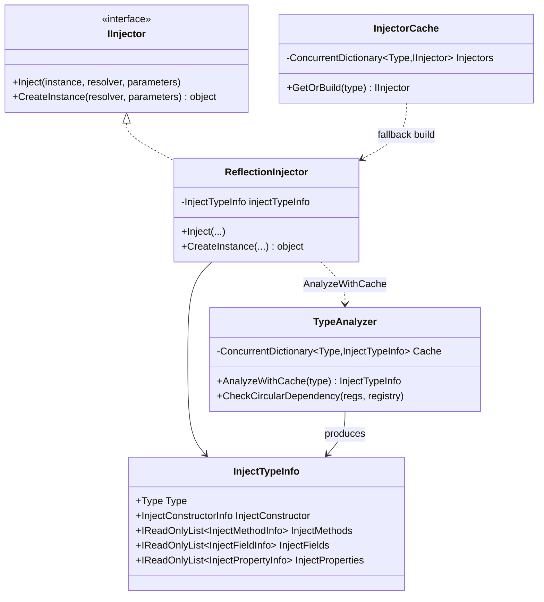
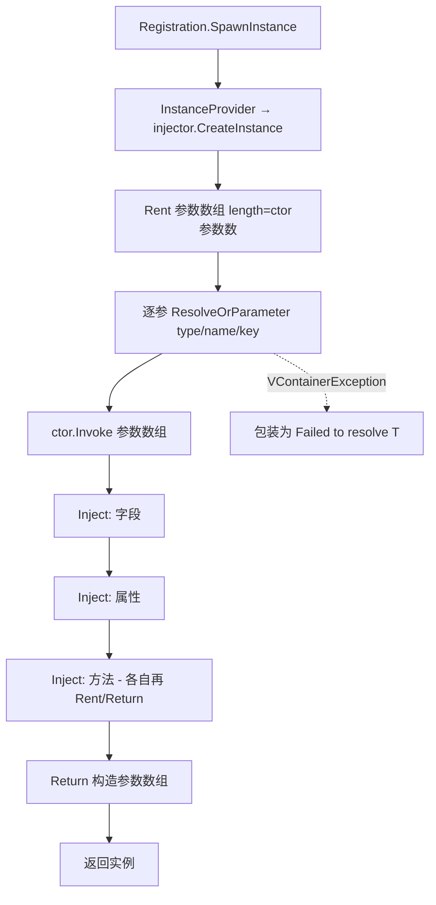
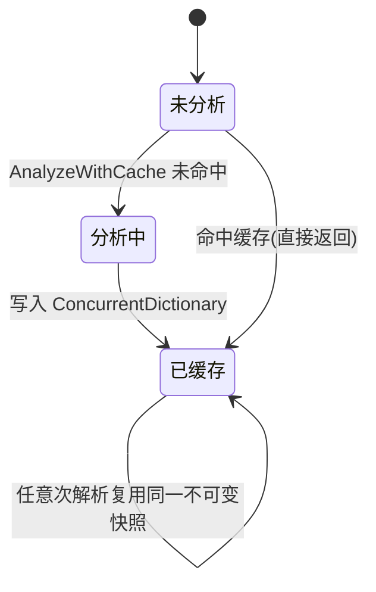

# M2 类型分析与反射注入器 · 解析

> 坐标：依赖 M1（参数数组池）；被 M3（`RegistrationBuilder.Build` 取 injector）、M4（`Container.Inject`）、M8（源生成器生成的注入器实现同一 `IInjector` 契约）依赖。
> 职责：把「一个 C# 类型」编译成「注入计划」（哪个构造、哪些字段/属性/方法要注入、各自的 Key），并在解析时执行注入。是「反射 vs 源生成」可替换的关键注入点。

---

## 一、契约定义

### 核心类型清单

| 文件 | 角色 | 可见性 |
|---|---|---|
| `IInjector` | 注入器契约：`Inject(instance,...)` + `CreateInstance(...)` | `public interface` |
| `InjectorCache` | 按 Type 缓存 `IInjector`，并决定用「源生成 / IL 织入 / 反射」哪种 | `public static` |
| `ReflectionInjector` | 基于反射的 `IInjector` 默认实现 | `internal sealed` |
| `TypeAnalyzer` | 把 Type 分析为 `InjectTypeInfo`（带缓存）+ 循环依赖检测 | `internal static` |
| `InjectTypeInfo` | 注入计划的不可变快照：构造/方法/字段/属性 | `internal sealed` |
| `InjectConstructorInfo/MethodInfo/FieldInfo/PropertyInfo` | 各注入点的反射元数据 + 预抽取的 Key | `internal sealed` |
| `TypedParameter/NamedParameter/FuncTyped/FuncNamed` | `IInjectParameter` 的 4 种覆盖参数实现 | `internal sealed` |
| `DependencyInfo`(struct) | 循环依赖检测时的依赖边描述 | `internal readonly struct` |

### 穿透语法的关键设计约束

1. **构造函数选择是「[Inject] 优先，否则参数最多」**：`TypeAnalyzer.Analyze` 遍历声明构造函数：标了 `[Inject]` 的最多只能有一个（多个抛异常）；没有标注时，选**参数数量最多**的那个。这与多数容器"最多参数"启发式一致，但显式 `[Inject]` 可强制覆盖。
2. **字段/属性/方法注入沿继承链向上扫描，且去重**：`while (type != null && type != typeof(object))` 逐级 `BaseType` 扫描 `DeclaredOnly` 成员；字段/属性按 `Name` 去重（子类覆盖父类同名只取一次），方法按 `GetBaseDefinition()` 去重（避免 override 重复注入）。字段重复同名直接抛异常。
3. **Key 在分析期一次性抽取并定格**：每个参数/字段/属性的 `[Key]` 在构造 `InjectXxxInfo` 时就 `GetCustomAttribute<KeyAttribute>()` 抽出存进 `ParameterKeys[]`/`Key`，解析期不再反射读特性。这是「分析一次、解析多次」的快照思想。
4. **注入顺序固定：字段 → 属性 → 方法**（构造注入在 `CreateInstance` 内、注入之前）。见 `ReflectionInjector.Inject`。方法注入在最后，可依赖已注入的字段/属性。
5. **`InjectorCache` 是三态选择器**：① 先找同程序集的 `{FullName}GeneratedInjector`（M8 源生成产物）→ ② 找已废弃的 IL 织入静态方法 `__GetGeneratedInjector` → ③ 都没有才 `ReflectionInjector.Build`。结果按 Type 缓存进 `ConcurrentDictionary`。这是「编译期注入点替换反射」的运行时开关。
6. **循环依赖检测在「构建期」完成，用 ThreadStatic 栈**：`CheckCircularDependency` 对每个注册做 DFS，遇到栈中已存在的同 `ImplementationType` 即报环（并打印路径）；唯一豁免：依赖由 `FuncInstanceProvider` 提供时（用户用 `Func<T>` 可手动打破环）。

### Mermaid 类图

---

## 二、生命周期与内存

### 动词语义表

| 操作 | 做什么 | 分配? | 备注 |
|---|---|---|---|
| `InjectorCache.GetOrBuild(t)` | 查缓存→否则按三态选择构建 injector | 仅首次/未命中 | 结果缓存复用 |
| `TypeAnalyzer.AnalyzeWithCache(t)` | 查缓存→否则反射全扫描建 `InjectTypeInfo` | 仅首次 | `ConcurrentDictionary` 缓存 |
| `ReflectionInjector.CreateInstance` | 租参数数组→解析每参→`ctor.Invoke`→`Inject` | 参数数组**租借**(M1) | finally 归还 |
| `ReflectionInjector.Inject` | 字段→属性→方法依次注入 | 方法注入租参数数组 | 字段/属性无额外数组 |
| `ResolveOrParameter(...)` | 先匹配覆盖参数，否则向容器解析 | 否 | 见跨层 |
| `CheckCircularDependency` | DFS 全注册检测环 | ThreadStatic 栈复用 | 构建期一次 |

### 单次解析的注入流程

### InjectTypeInfo 的状态（缓存视角）

---

## 三、跨层桥接

- **核心注入点 `ResolveOrParameter`（在 M4 的 `IObjectResolverExtensions`）**：注入器不直接调 `resolver.Resolve`，而是经 `ResolveOrParameter(parameterType, parameterName, parameters, key)`。逻辑：① `parameters==null` → 直接按 type+key 解析；② 否则遍历覆盖参数，`Match(type,name)` 命中则用覆盖值；③ 都不命中按 key 或无 key 解析。**这是 `WithParameter(...)` 覆盖能注入进构造/方法的唯一通道**。
- **向 M3 桥接**：`RegistrationBuilder.Build()` 调 `InjectorCache.GetOrBuild(ImplementationType)` 拿 injector，包进 `InstanceProvider`。
- **向 M8 桥接**：M8 生成的 `XxxGeneratedInjector` 实现同一 `IInjector`，其 `CreateInstance`/`Inject` 内调用的也是 `resolver.ResolveOrParameter(...)`（见 Emitter 生成代码），因此**反射版与源生成版在数据流上完全等价**，只是省去反射开销。
- 跨层 DTO 快照：`InjectTypeInfo` 是典型的「分析期快照」——一旦建好就只读，多次解析共享，不携带任何 per-resolve 状态。

---

## 四、落地难点（脱离框架仿写时最有价值的 3 点）

1. **构造选择 + 继承链去重的精确语义**：仿写时最易错的是「父子同名字段/override 方法的去重」与「[Inject] 构造唯一性校验」。漏掉去重会导致同一成员注入两次或基类方法被重复 invoke；用 `GetBaseDefinition()` 比较是正确判定 override 的方式。
2. **覆盖参数（WithParameter）的匹配优先级**：`TypedParameter` 按类型匹配、`NamedParameter` 按参数名匹配，匹配成功直接短路、不再查容器。仿写时要决定「同时有 typed 与 named 命中谁优先」——VContainer 是按 `Parameters` 列表顺序先到先得，没有显式优先级，这点容易踩坑。
3. **构建期循环依赖检测**：要在不真正实例化的前提下，仅凭 `InjectTypeInfo` + `Registry.TryGet` 沿构造/方法/字段/属性的依赖边做 DFS。难点在于：① 只有被 `AnalyzeWithCache` 过的类型才在 `Cache` 里（检测前需保证分析过）；② `Func<T>` 提供者要豁免（否则工厂式自引用会误报）；③ 用 ThreadStatic 栈复用避免每次分配。
