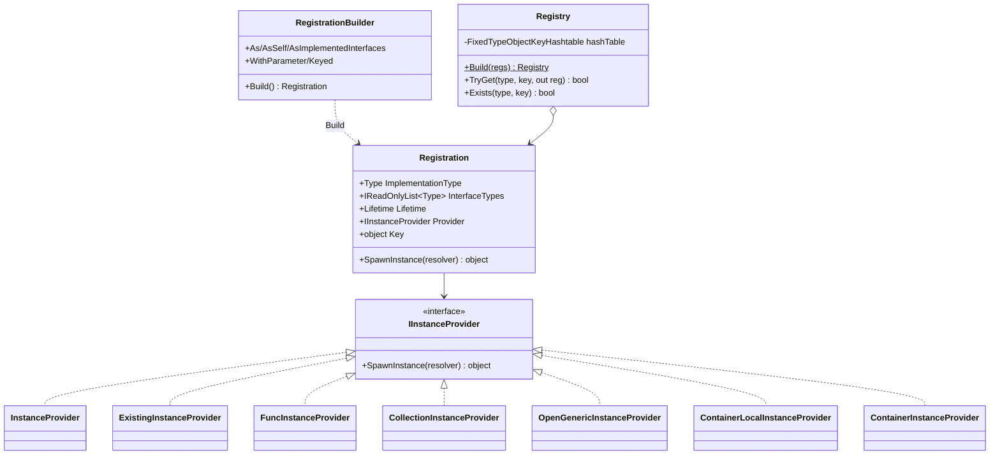
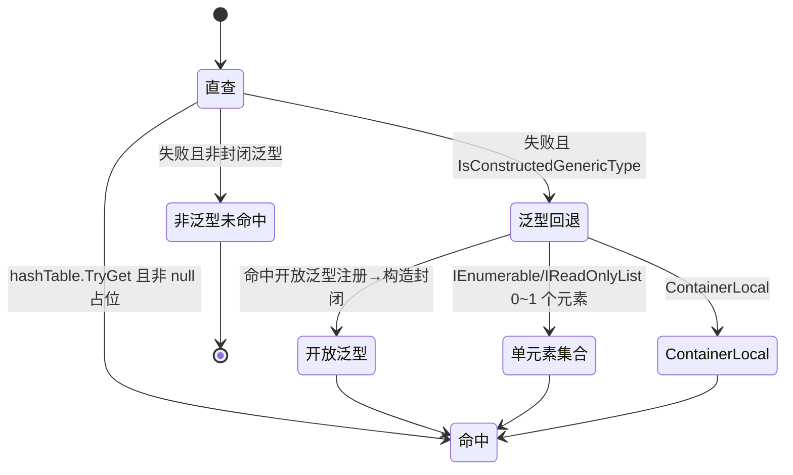

# M3 注册模型与实例提供者 · 解析

> 坐标：依赖 M1（哈希表/RuntimeTypeCache）、M2（InjectorCache/IInjector）；被 M4（容器按 Registration 解析）、M7（诊断按 RegistrationBuilder 关联）依赖。
> 职责：把用户的「Register<Impl>().As<IFoo>()」声明，转译为不可变的 `Registration`（契约→实现+生命周期+Provider），并构建出 O(1) 查表的 `Registry`。`IInstanceProvider` 是「实例从哪来」的策略族。

---

## 一、契约定义

### 核心类型清单

| 文件 | 角色 | 可见性 |
|---|---|---|
| `Registration` | 不可变注册记录：实现类型/契约集/生命周期/Provider/Key | `public sealed` |
| `RegistrationBuilder` | 流式声明 + `Build()` 产出 `Registration` | `public class` |
| `Registry` | 把所有 Registration 灌入哈希表，提供 `TryGet`/`Exists`，并处理集合/泛型/Local 回退 | `public sealed` |
| `IInstanceProvider` | 实例来源策略：`SpawnInstance(resolver)` | `public interface` |
| `InstanceProvider` | 经 `IInjector` 构造实例（最常用） | `internal sealed` |
| `ExistingInstanceProvider` | 返回已存在实例（RegisterInstance） | `internal sealed` |
| `FuncInstanceProvider` | 调用 `Func<IObjectResolver,object>` | `internal sealed` |
| `CollectionInstanceProvider` | 把多个注册聚合为数组/IEnumerable/IReadOnlyList | `internal sealed` |
| `OpenGenericInstanceProvider` | 开放泛型 → 按封闭类型参数构造封闭 Registration（带缓存） | `public class` |
| `ContainerLocalInstanceProvider` | 把值包进 `ContainerLocal<T>` | `internal sealed` |
| `ContainerInstanceProvider` | 返回 resolver 自身（`IObjectResolver` 默认注册） | `internal sealed` |
| `Func/Instance/OpenGeneric/ComponentRegistrationBuilder` | Build() 重写，产出对应 Provider | 各异 |

### 穿透语法的关键设计约束

1. **Registration 完全不可变**：所有字段 `readonly`，构造后不变。它本身不含任何实例状态——"单例实例"缓存在容器侧（M4 的 `sharedInstances`），Registration 只是个**可被多容器/多作用域共享的描述**。这使同一 Registration 能作为字典 key 在父子作用域间路由。
2. **`Registry.Build` 用 ThreadStatic 字典做"契约→Registration"的展开 + 覆盖**：每个注册的每个 `InterfaceType` 都映射到该 Registration；`ImplementationType` 也以 `(Impl,Key)` 入表（标记位，可能为 null 占位）。**后注册覆盖先注册**（同 `(service,key)`）。
3. **集合是「自动派生注册」**：当同一 service 被注册 ≥2 次，`AddToBuildBuffer` 会自动合成一个 `CollectionInstanceProvider`，并为 `IEnumerable<T>`/`IReadOnlyList<T>`/`T[]` 建注册。`AnyKey`（一个私有 sentinel 对象）用于追踪"该 service 是否已有任意 keyed/非 keyed 成员"。集合引用本身是 `Transient`，成员各自保留生命周期。
4. **三层泛型/集合/Local 回退在查表 miss 时触发**：`Registry.TryGet` 对封闭泛型类型按序尝试：① 开放泛型注册 → `OpenGenericInstanceProvider.GetClosedRegistration`（构造封闭 Registration 并缓存）；② 单元素集合回退（请求 `IEnumerable<T>` 但只有 0/1 个 T）；③ `ContainerLocal<T>` 回退。这是"声明少、解析灵活"的核心。
5. **`OpenGenericInstanceProvider.SpawnInstance` 永远抛异常**：开放泛型 Provider 自己不产实例，它只负责"按类型参数生产封闭 Registration"；真正的实例化由封闭 Registration 内的 `InstanceProvider` 完成。封闭 Registration 按 `TypeParametersKey`（类型参数数组 + Key）缓存，避免重复 `MakeGenericType`。
6. **`RegistrationBuilder.As` 做契约可赋值校验**：`AddInterfaceType` 检查 `interfaceType.IsAssignableFrom(ImplementationType)`，不满足直接抛异常——在声明期（而非解析期）拦截"声明实现了它根本没实现的接口"。

### Mermaid 类图



---

## 二、生命周期与内存

### 动词语义表

| 操作 | 做什么 | 分配? | 备注 |
|---|---|---|---|
| `RegistrationBuilder.Build()` | 取 injector + 包 Provider + new Registration | 是（构建期一次） | 各子类重写产不同 Provider |
| `Registry.Build(regs)` | 展开契约、合成集合、灌哈希表 | 是（构建期一次） | ThreadStatic 字典复用 |
| `Registry.TryGet` | 查表→miss 则三层回退 | 回退命中时可能 new Registration | 封闭泛型/Local 回退会缓存 |
| `InstanceProvider.SpawnInstance` | `injector.CreateInstance` | 视注入而定 | 委托给 M2 |
| `ExistingInstanceProvider.SpawnInstance` | 返回固有实例 | 否 | 不参与 Dispose 跟踪（见 M4） |
| `CollectionInstanceProvider.SpawnInstance` | 跨作用域收集成员→建数组逐个 resolve | 数组 + ListPool 缓冲 | 见下流程 |
| `OpenGenericInstanceProvider.GetClosedRegistration` | MakeGenericType + 建封闭 Registration | 首次构造，后缓存 | `ConcurrentDictionary` |

### Registry 构建 + 集合派生流程

```mermaid
flowchart TD
    A[ContainerBuilder.BuildRegistry] --> B[逐个 RegistrationBuilder.Build]
    B --> C[追加 IObjectResolver 默认注册]
    C --> D[Registry.Build]
    D --> E{每个 service 已存在?}
    E -- 否 --> F[加入 buildBuffer: key & AnyKey]
    E -- 是 --> G[合成/复用 CollectionInstanceProvider]
    G --> H[为 IEnumerable/IReadOnlyList/T[] 建集合注册]
    H --> I[collection.Add 新成员, 后者覆盖 key]
    F --> J[buildBuffer.ToArray → FixedTypeObjectKeyHashtable]
    I --> J
    J --> K[TypeAnalyzer.CheckCircularDependency]
```

### TryGet 的回退状态机



---

## 三、跨层桥接

- **向 M2**：`RegistrationBuilder.Build` / `OpenGenericInstanceProvider.CreateRegistration` 调 `InjectorCache.GetOrBuild` 取 injector。
- **向 M4**：容器只认 `Registration`。`Container.Resolve(registration)` 按 `registration.Lifetime` 决定缓存策略，调 `registration.SpawnInstance(this)` → `Provider.SpawnInstance`。`CollectionInstanceProvider`/`ContainerLocalInstanceProvider` 内部会判断 `resolver is IScopedObjectResolver scope` 来跨作用域收集——**这是 M3 与 M4 作用域树双向耦合的点**。
- **跨层 DTO 快照**：`RegistrationElement`(struct，Registration + 注册它的容器)是集合解析时跨作用域传递的临时快照，用 `ListPool` 借还，记录"某成员属于哪个作用域"，以便按生命周期选对的 resolver（单例用注册它的容器、瞬时用当前作用域）。
- **向 M7**：`ContainerBuilder.Register` 时 `Diagnostics?.TraceRegister(new RegisterInfo(builder))`；`BuildRegistry` 中 `Diagnostics?.TraceBuild(builder, registration)` 把 builder 与最终 registration 关联。

---

## 四、落地难点（脱离框架仿写时最有价值的 3 点）

1. **集合的自动派生与跨作用域聚合**：最难的不是"多个注册放进数组"，而是 ① 何时自动生成集合注册（首次出现第 2 个同 service 注册时）、② 解析 `IEnumerable<T>` 要**沿父作用域链合并**所有作用域的同类型集合、③ 单例成员要用"注册它的那个作用域"来 resolve（保证单例唯一），瞬时成员用当前作用域。`CollectionInstanceProvider.CollectFromParentScopes` + `RegistrationElement` 就是为此设计。
2. **开放泛型的"Provider 不产实例"反直觉设计**：`OpenGenericInstanceProvider` 是个"注册工厂"而非"实例工厂"，`SpawnInstance` 直接抛异常。真正解析时，`Registry.TryGet` 发现请求的是封闭泛型 → 找到开放注册 → 调 `GetClosedRegistration` 即时合成一个封闭 Registration（内含正常 `InstanceProvider`）→ 容器再对这个封闭 Registration 正常解析。仿写时若让开放 Provider 直接产实例会卡在"不知道封闭类型参数"。
3. **"先注册覆盖 / 集合保留"的二义性消解**：单次 `Resolve<IFoo>()` 在多注册时返回**最后一个**；`Resolve<IEnumerable<IFoo>>()` 返回**全部**。这要求 `Registry.Build` 同时维护"单值键（被覆盖）"和"集合键（累积）"两套映射，并用 `AnyKey` sentinel 追踪 service 是否已有成员。这套双轨在仿写时极易写漏其一。
