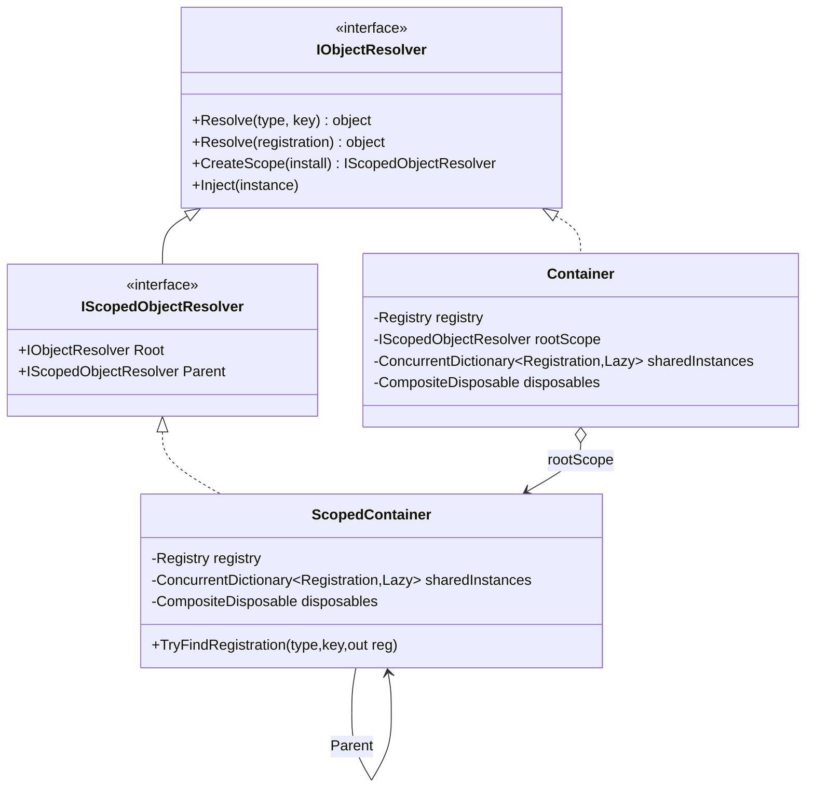
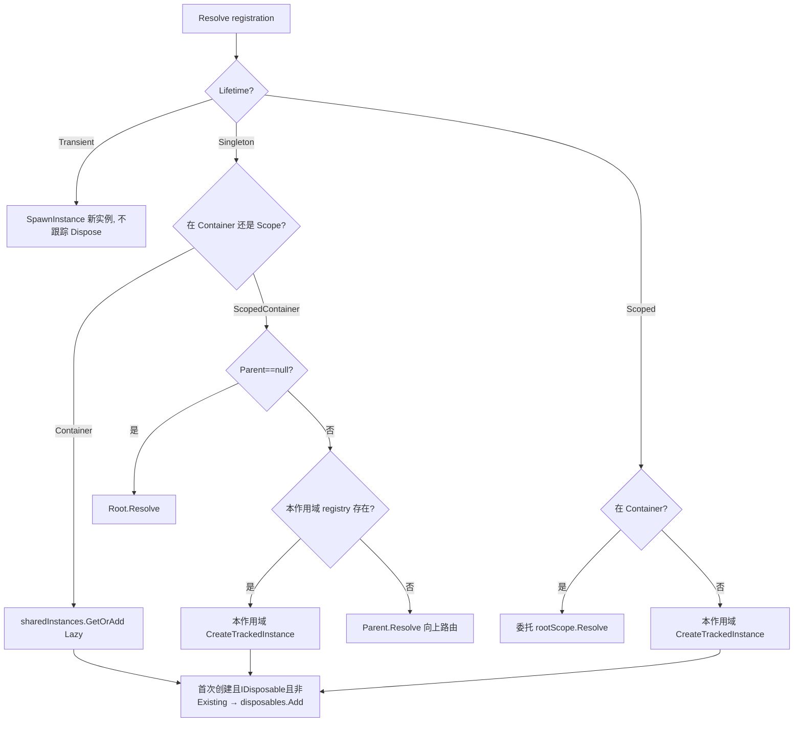
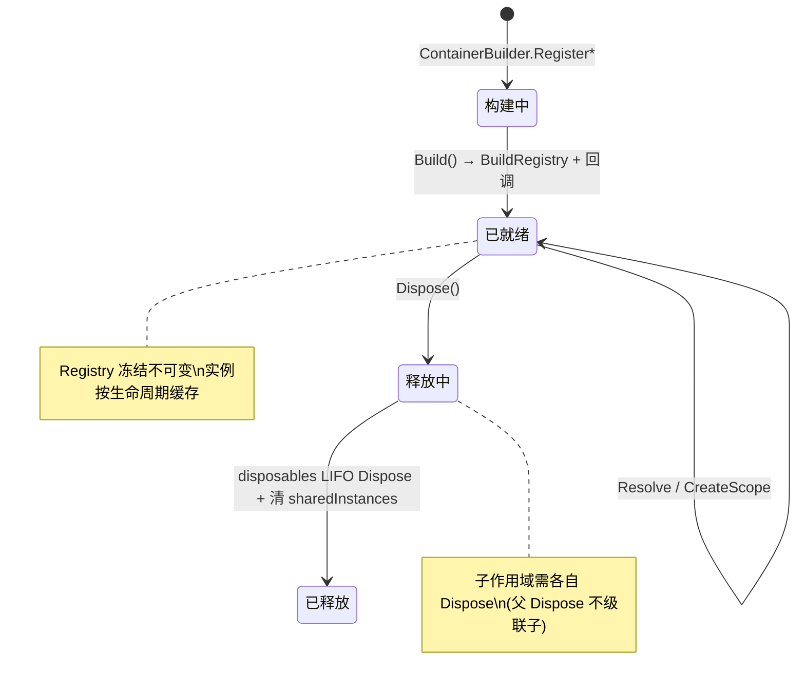

# M4 容器解析与作用域树 · 解析

> 坐标：依赖 M1（CompositeDisposable）、M2（InjectorCache.Inject）、M3（Registration/Registry/Provider）；被 M5/M6/M7 依赖。
> 职责：按 `Lifetime` 把 `Registration` 解析为实例、维护 Root↔Scoped 的作用域树、用 `Lazy<object>` 保证单例/Scoped 只构造一次、用 `CompositeDisposable` 管理释放。这是整个容器的"运行时引擎"。

---

## 一、契约定义

### 核心类型清单

| 文件/类型 | 角色 | 可见性 |
|---|---|---|
| `IObjectResolver` | 解析契约：Resolve/TryResolve/CreateScope/Inject/TryGetRegistration | `public interface` |
| `IScopedObjectResolver` | 作用域解析器：附加 Root/Parent | `public interface` |
| `Container` | 根容器：管理单例缓存 + 内嵌 rootScope | `public sealed` |
| `ScopedContainer` | 作用域容器：Scoped 缓存 + 父链查找 | `public sealed` |
| `ContainerBuilder` / `ScopedContainerBuilder` | 收集注册 → Build 出容器 | `public` |
| `Lifetime` | Transient/Singleton/Scoped 枚举 | `public enum` |
| `ContainerLocal<T>` | 把任意服务"本作用域化"的包装 | `public sealed` |
| `IObjectResolverExtensions` | `Resolve<T>` / `ResolveOrParameter` 泛型门面 | `public static` |

### 穿透语法的关键设计约束

1. **Root 与 Scope 是同一套语义的两个实现**：`Container`（根）内部其实也持有一个 `rootScope`（ScopedContainer，parent=null）。`Container.ResolveCore` 处理 Singleton 缓存，Scoped 委托给 `rootScope`；`ScopedContainer.ResolveCore` 处理 Scoped 缓存，Singleton 向上路由。两者各有独立的 `sharedInstances` + `disposables`。
2. **单例/Scoped 用 `ConcurrentDictionary<Registration, Lazy<object>>` 保证"构造一次"**：`GetOrAdd(registration, createInstance)` 拿到 `Lazy<object>`，`lazy.Value` 触发实际构造。Key 是 Registration 引用——这正是 M3"Registration 不可变可共享"的回报。`Lazy` 默认线程安全模式保证并发解析下单例只构造一次。
3. **`IsValueCreated` 决定是否登记 Dispose**：`CreateTrackedInstance` 先记录 `lazy.IsValueCreated`（取值前），取 `lazy.Value` 后，仅当**之前未创建** 且实例是 `IDisposable` 且 **Provider 不是 ExistingInstanceProvider** 时，才 `disposables.Add`。这保证每个容器创建的可弃实例只登记一次、外部实例不被容器误 Dispose。
4. **Singleton 的跨作用域路由很精细**：`ScopedContainer.ResolveCore` 的 Singleton 分支：① `Parent is null`（即根作用域）→ 交给 `Root.Resolve`；② 该单例在**本作用域 registry 存在** → 在本作用域创建并跟踪（"作用域级单例"）；③ 否则 → `Parent.Resolve`（向上找拥有者）。即"单例归属于最先声明它的那一层作用域"。
5. **`TryFindRegistration` 沿父链查找、`Resolve(Registration)` 不查找**：两个 Resolve 重载语义不同——`Resolve(Type)` 会沿作用域链 `TryFindRegistration`；`Resolve(Registration)` 直接按已知注册解析（用于集合/已定位场景）。这区分了"按类型找"和"按注册解"。
6. **`IObjectResolver` 自身可注入**：`BuildRegistry` 末尾追加一条 `typeof(IObjectResolver)` 的 Transient 注册（`ContainerInstanceProvider` 返回 resolver 自己）。因此任何类都能注入"当前容器"，且解析时返回的是**当前作用域的 resolver**（因 Transient + Provider 返回入参 resolver）。

### Mermaid 类图

---

## 二、生命周期与内存

### 动词语义表

| 操作 | 做什么 | 分配/缓存? | 释放? |
|---|---|---|---|
| `Resolve(Type,key)` | TryFindRegistration → Resolve(reg) | 视生命周期 | — |
| `Resolve(Registration)` | (有 Diagnostics 则 Trace) → ResolveCore | — | — |
| ResolveCore Transient | 直接 `SpawnInstance` 每次新建 | 每次分配 | **不跟踪**（用户自管） |
| ResolveCore Singleton | `sharedInstances.GetOrAdd` → Lazy.Value | 首次构造缓存 | 首次且 IDisposable 登记 |
| ResolveCore Scoped | 本作用域 `CreateTrackedInstance` | 本作用域缓存 | 同上 |
| `CreateScope(install)` | new ScopedContainerBuilder → BuildScope | 新 registry + 容器 | — |
| `Inject(instance)` | InjectorCache.GetOrBuild → Inject | 视注入 | — |
| `Dispose()` | Diagnostics.Clear + disposables.Dispose(LIFO) + 清缓存 | — | **真实释放** |

### 三种生命周期解析流程

### 容器生命周期状态机

---

## 三、跨层桥接

- **构建回调（注入点）**：`ContainerBuilder.RegisterBuildCallback(Action<IObjectResolver>)` 收集回调，`Build` 完成后 `EmitCallbacks` 依次调用。`LifetimeScope` 用它做 `SetContainer`、`EntryPointsBuilder` 用它触发 `Dispatch`、`RegisterComponent` 用它"强制解析触发注入"。这是"容器建好那一刻"的统一 Hook。
- **向 M5**：`LifetimeScope.Build` 调 `Parent.Container.CreateScope(...)` 或新建 `ContainerBuilder().Build()`，并用 `RegisterBuildCallback(SetContainer)` 拿回容器。
- **向 M3（双向）**：`CollectionInstanceProvider`/`ContainerLocalInstanceProvider` 在 `SpawnInstance` 内会判定 `resolver is IScopedObjectResolver` 并沿 `Parent` 链聚合——容器把 `this`(当前作用域) 传给 Provider，Provider 反过来用作用域树。
- **跨层 DTO 快照**：`Lazy<object>` 是"单例构造的一次性快照容器"。`createInstance` 字段是个缓存的工厂委托（避免每次 GetOrAdd 分配闭包）。
- **诊断旁路**：`Resolve(Registration)` 在 `Diagnostics != null` 时走 `Diagnostics.TraceResolve(reg, ResolveCore)`，把实际解析包在计时/计数里（M7）。

---

## 四、落地难点（脱离框架仿写时最有价值的 3 点）

1. **单例归属层级的路由**：单例不是"全局唯一"，而是"声明它的那层作用域唯一"。`ScopedContainer` 解析 Singleton 时要判断"这个注册是不是我这层 registry 里有的"——是则本层建单例，否则上抛给 parent。漏掉这一步会导致：要么子作用域重复建单例、要么本应在子作用域覆盖的单例错误地走到根。
2. **Dispose 跟踪的三重守卫**：只在 ①首次创建（`!created`，避免重复登记）②实例是 `IDisposable` ③Provider 不是 `ExistingInstanceProvider`（外部实例不归容器管）时才登记。三者缺一都会出问题：漏①重复 Dispose、漏③把用户的实例给 Dispose 了。释放顺序必须 LIFO（依赖后建先释放）。
3. **`Resolve(Type)` 与 `Resolve(Registration)` 的语义分裂**：前者沿作用域链查找注册、后者直接解析已知注册。集合解析、单例向上路由都依赖"按 Registration 直接解析"。仿写时若只实现按类型解析，会在"集合成员要用特定作用域解析"时无从下手。还要注意 `Lazy` 的线程安全模式选择——错误的模式会让并发解析破坏单例唯一性。
