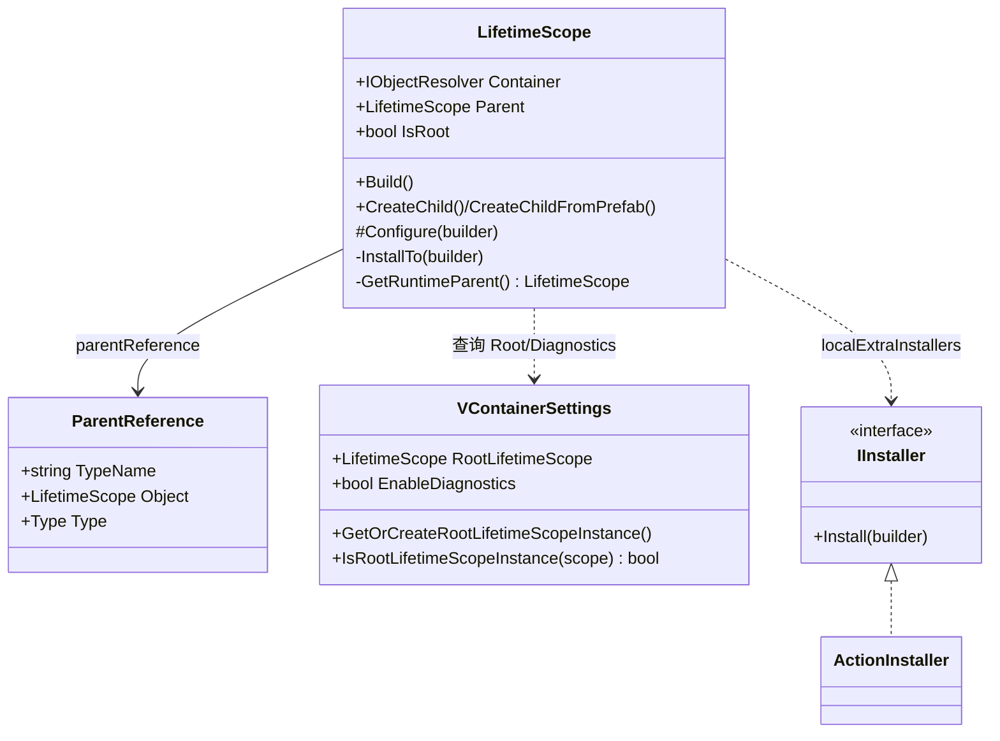
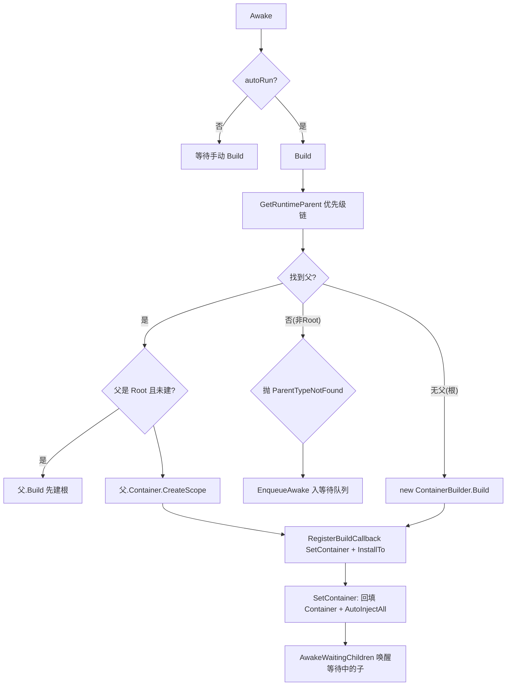
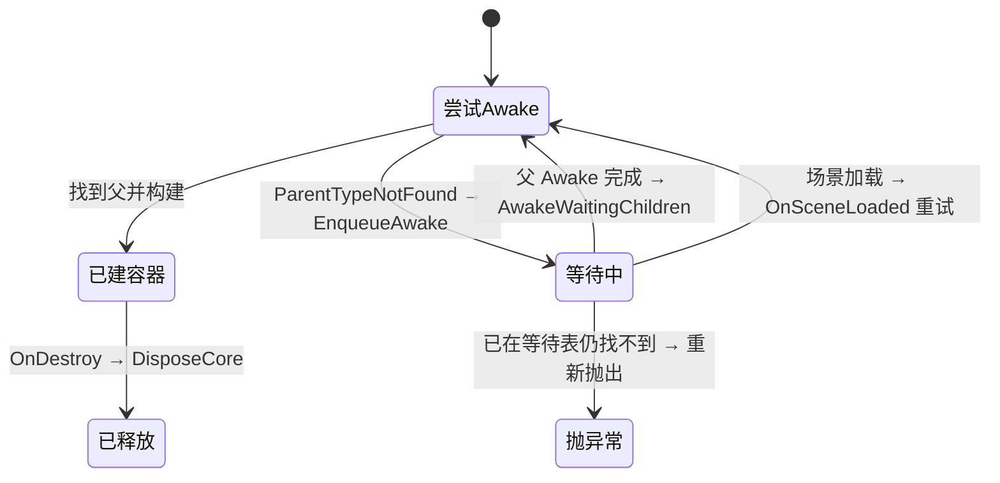

# M5 Unity 生命周期作用域 · 解析

> 坐标：包装层。依赖 M4（CreateScope/Build/RegisterBuildCallback）、M3（RegisterInstance）；被 M6（入口点依赖容器已建好）依赖。
> 职责：把"纯 C# 容器"的构建/释放时机，绑定到 Unity 的 `MonoBehaviour.Awake/OnDestroy` 与场景加载事件上，并解决"父作用域可能尚未 Awake"的时序难题。

---

## 一、契约定义

### 核心类型清单

| 文件 | 角色 | 可见性 |
|---|---|---|
| `LifetimeScope` | MonoBehaviour，容器在场景中的宿主；Awake 建容器、OnDestroy 释放 | `public partial class` |
| `LifetimeScope.AwakeScheduler`(partial) | 处理父未就绪时的"等待队列"与场景加载重试 | partial 补充 |
| `ParentReference`(struct) | 序列化的父作用域类型引用（按 TypeName 反序列化为 Type） | `public struct` |
| `VContainerSettings` | ScriptableObject，全局根作用域 + 诊断开关 | `public sealed` |
| `IInstaller` / `ActionInstaller` | 安装器契约：`Install(IContainerBuilder)`；Action 适配 | `public` |
| `ParentOverrideScope` / `ExtraInstallationScope`(struct) | `using` 作用域，临时压栈全局父/额外安装器 | `public readonly struct` |
| `VContainerParentTypeReferenceNotFound` | 父类型引用找不到的异常（触发等待重试） | `public sealed Exception` |

### 穿透语法的关键设计约束

1. **`[DefaultExecutionOrder(-5000)]` 保证 LifetimeScope 早于普通脚本 Awake**：容器必须在被注入的脚本之前建好。这是用 Unity 执行顺序机制保证 DI 时序的关键声明。
2. **父作用域解析有明确优先级链**（`GetRuntimeParent`）：① 自己是 Root → null；② `parentReference.Object` 显式引用；③ `FindParent()` 用户重写；④ `parentReference.Type` 按类型在场景查找（找不到抛 `VContainerParentTypeReferenceNotFound`）；⑤ 全局 `GlobalOverrideParents` 栈顶（`EnqueueParent`）；⑥ `VContainerSettings` 的根作用域。
3. **"父未就绪"用等待队列 + 异常重试解决**（AwakeScheduler）：Awake 时若父类型引用找不到（非 Root），捕获 `VContainerParentTypeReferenceNotFound` → `EnqueueAwake(this)` 入等待表。当父作用域 Awake 完成后 `AwakeWaitingChildren` 唤醒匹配的子；或场景加载完成 `OnSceneLoaded` 重试。这解决了"子脚本所在 GameObject 比父先 Awake"的时序竞态。
4. **容器构建经 `RegisterBuildCallback(SetContainer)` 回填**：`Build` 不直接拿返回值赋 `Container`，而是注册构建回调 `SetContainer`，在容器建好瞬间回填 `Container` 字段并触发 `AutoInjectAll`。这统一走 M4 的回调注入点。
5. **`InstallTo` 是安装器的汇聚点 + 自动注册**：依次执行 `Configure`(子类重写) → `localExtraInstallers` → 全局 `GlobalExtraInstallers` → 自动 `RegisterInstance<LifetimeScope>(this)` → `EntryPointsBuilder.EnsureDispatcherRegistered`(M6 注入点)。安装器执行后 `localExtraInstallers.Clear()`。
6. **全局栈用 `readonly struct` + `using` 实现作用域化压栈**：`ParentOverrideScope`/`ExtraInstallationScope` 在构造时 `Push`、`Dispose` 时 `Pop`，配合 `lock(SyncRoot)` 线程安全。这是"临时改变下一个被创建作用域的父/安装内容"的 RAII 式 Helper。
7. **Root 作用域由 `VContainerSettings` 单例 Instantiate 并 `DontDestroyOnLoad`**：`GetOrCreateRootLifetimeScopeInstance` 把配置的 Root prefab 实例化为跨场景存活的全局根（先 `SetActive(false)` 再实例化，避免子的 Awake 早于父建容器）。

### Mermaid 类图

---

## 二、生命周期与内存

### 动词语义表

| 操作 | 做什么 | 分配? | 释放? |
|---|---|---|---|
| `Awake()` | autoRun 则 `Build()`；父未就绪则入等待队列 | 容器构建 | — |
| `Build()` | 定位父 → 父容器 `CreateScope` 或新建 → 回调 SetContainer | 新容器 | — |
| `SetContainer(c)` | 回填 `Container` + `AutoInjectAll` | — | — |
| `InstallTo(b)` | Configure + 安装器 + 自注册 + 入口点调度注册 | — | clear localInstallers |
| `CreateChild*()` | 新建子 GameObject + AddComponent + 设父引用 | GameObject + Component | — |
| `OnDestroy()` → `DisposeCore` | `Container.Dispose()` + 移除诊断采集器 + CancelAwake | — | **释放容器** |
| `Dispose()` | DisposeCore + Destroy(gameObject) | — | 释放 + 销毁 GO |
| `EnqueueAwake/AwakeWaitingChildren` | 等待队列增删 + 唤醒重试 | ListPool 缓冲 | — |

### LifetimeScope Awake → Build 时序

### 父未就绪的等待状态机

---

## 三、跨层桥接

- **向 M4**：`Build` 是 M5↔M4 的接缝——根用 `new ContainerBuilder().Build()`，子用 `Parent.Container.CreateScope(builder => {...})`。两条路径都通过 `RegisterBuildCallback(SetContainer)` 拿回容器引用。
- **向 M6**：`InstallTo` 末尾 `EntryPointsBuilder.EnsureDispatcherRegistered(builder)`，把 `EntryPointDispatcher` 注册进容器，并注册一个构建回调在容器建好后 `Dispatch()`（启动 tickables 等）。M6 的执行完全由 M5 的安装触发。
- **向 M3**：`InstallTo` 自动 `RegisterInstance<LifetimeScope>(this).AsSelf()`，让任意服务能注入所在的 LifetimeScope；`ObjectResolverUnityExtensions.Instantiate/InjectGameObject` 对实例化的 prefab 走 `container.Inject`(M4)。
- **跨层 DTO 快照**：`ParentReference` 是"序列化态的类型引用"——存 `TypeName` 字符串，反序列化时遍历 AppDomain 程序集 `GetType(TypeName)` 还原为 `Type`。这是把"编辑器里拖拽配置的父类型"安全持久化的快照机制。
- **全局栈 Helper**：`EnqueueParent`/`Enqueue` 返回 `using` 作用域，常用于"在一段代码内创建的所有作用域都临时挂到某父/带某额外安装"，典型用于测试与动态场景装载。

---

## 四、落地难点（脱离框架仿写时最有价值的 3 点）

1. **DI 时序与 Unity 生命周期的对齐**：核心矛盾是"被注入脚本的 Awake 可能早于其父 LifetimeScope 的 Awake"。VContainer 三管齐下：① `[DefaultExecutionOrder(-5000)]` 把 LifetimeScope 整体提前；② 父未就绪时**捕获异常入等待队列**而非崩溃；③ 父 Awake 完成或场景加载完成时**重试唤醒**。仿写到任何"组件化 DI"框架都要解决这个时序竞态。
2. **Root 作用域的跨场景单例化**：根作用域要 `DontDestroyOnLoad` 且全局唯一，且要先 `SetActive(false)` 再实例化（防止其内部子脚本在容器建好前 Awake）。`VContainerSettings` 用 preloaded asset + `RuntimeInitializeOnLoadMethod` 在场景加载前注入单例。仿写时漏掉"先禁用再实例化"会引发空容器注入。
3. **回调式容器回填而非返回值赋值**：`Build` 用 `RegisterBuildCallback(SetContainer)` 而不是 `Container = builder.Build()`。原因是 `CreateScope` 内部的构建流程（含 EmitCallbacks）需要在"容器实例已存在但对外引用尚未暴露"的时刻就能回填，且能与"容器建好后立即 Dispatch 入口点"的回调链统一顺序。仿写时若用返回值赋值，会与"构建回调里就要用到 Container 字段"的逻辑产生先后矛盾。
