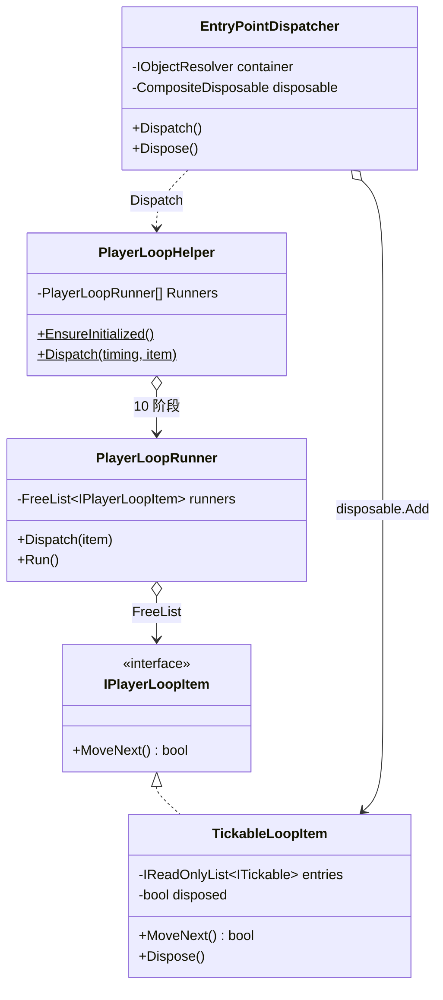
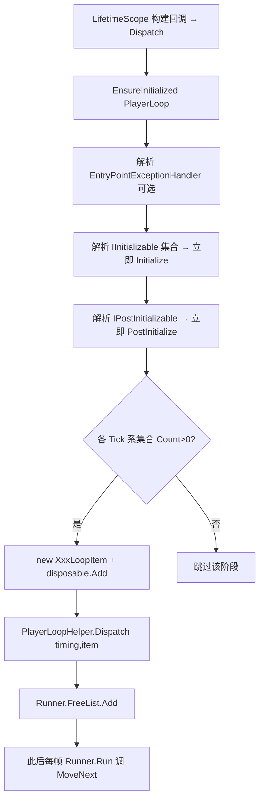
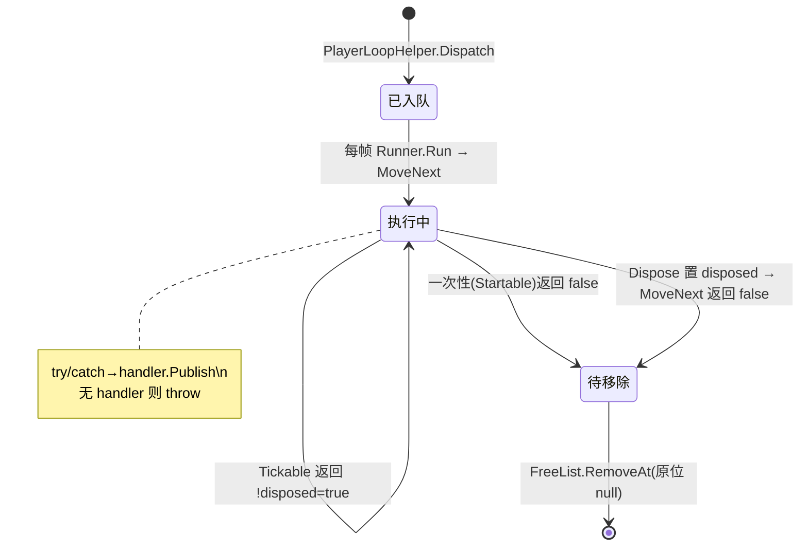

# M6 入口点与 PlayerLoop 调度 · 解析

> 坐标：包装层。依赖 M4（按 `ContainerLocal<IReadOnlyList<T>>` 解析入口点集合）、M5（LifetimeScope 安装时注册 Dispatcher）、M1（FreeList 承载每帧 tickable）。
> 职责：把实现了 `IStartable`/`ITickable`/`IInitializable` 等接口的 DI 对象，挂入 Unity PlayerLoop 的对应阶段，并在执行时统一容错。这是"让 POCO 对象拥有 Unity 生命周期回调"的桥梁。

---

## 一、契约定义

### 核心类型清单

| 文件 | 角色 | 可见性 |
|---|---|---|
| `EntryPointDispatcher` | 解析各入口点集合 → 立即执行 Init，挂载 tickable 到 PlayerLoop | `public sealed` |
| `PlayerLoopHelper` | 把 10 个 VContainer 阶段插入 Unity PlayerLoop；`Dispatch` 入队 | `internal static` |
| `PlayerLoopRunner` | 单阶段的 tickable 容器（`FreeList`）+ 每帧 `Run` | `internal sealed` |
| `IPlayerLoopItem` | `bool MoveNext()`：返回 false 即从循环移除 | `internal interface` |
| `*LoopItem`（Startable/Tickable/...） | 把入口点集合包成 IPlayerLoopItem，遍历执行 + 容错 | `internal sealed` |
| `EntryPointExceptionHandler` | 包装用户的 `Action<Exception>` | `internal sealed` |
| `IStartable/ITickable/IInitializable/...` | 入口点生命周期接口（各一个无参方法） | `public interface` |
| `IAsyncStartable` | 异步启动（UniTask/Awaitable/Task 按宏切换） | `public interface` |

### 穿透语法的关键设计约束

1. **入口点按 `ContainerLocal<IReadOnlyList<T>>` 解析**：`Dispatcher.Dispatch` 不直接 `Resolve<IReadOnlyList<IStartable>>`，而是 `Resolve<ContainerLocal<IReadOnlyList<IStartable>>>().Value`。`ContainerLocal<T>` 的回退（M3）保证拿到的是**仅本作用域 + 父作用域**视角下的集合，避免子作用域重复执行父的入口点（`localScopeOnly` 语义）。
2. **Init/PostInit 是"立即同步执行"，Tick 系是"挂入 PlayerLoop 每帧执行"**：`Initialize()`/`PostInitialize()` 在 `Dispatch()` 当场 for 循环跑完；而 Startable/Tickable/LateTickable 等被包成 `*LoopItem` 通过 `PlayerLoopHelper.Dispatch(timing, item)` 注册到对应阶段的 `PlayerLoopRunner`。
3. **`IPlayerLoopItem.MoveNext` 的返回值语义是"是否继续"**：Startable/PostStartable/AsyncStartable 的 `MoveNext` 执行一次后 `return false`（一次性，执行完即被 `RemoveAt` 移除）；Tickable 系 `return !disposed`（持续每帧，直到 Dispose）。这统一用迭代器语义表达"一次性 vs 持续性"。
4. **PlayerLoop 注入是进程级、惰性、once**：`PlayerLoopHelper.EnsureInitialized` 用 `Interlocked.CompareExchange` 保证只初始化一次，把 10 个自定义 `PlayerLoopSystem`（VContainerInitialization...PostLateUpdate）插入到 Unity 的 `Initialization/EarlyUpdate/FixedUpdate/Update/PreLateUpdate` 子系统中的特定位置。
5. **容错策略：有 handler 则发布，无则按阶段不同处理**：`*LoopItem.MoveNext` 内 `try/catch`，捕获后 `exceptionHandler.Publish(ex)`；**无 handler 时**——Tickable 系 `throw`（重新抛出中断该帧），Startable 系也 `if (handler==null) throw`。默认 `EntryPointsBuilder` 注册的 handler 是 `UnityEngine.Debug.LogException`，所以默认行为是"记录日志并继续"。
6. **Dispatcher 持有 `CompositeDisposable` 管理 LoopItem**：每个挂载的 `*LoopItem` 都 `disposable.Add`，Dispatcher.Dispose 时统一 Dispose（置 `disposed=true`，下一帧 `MoveNext` 返回 false 自动从 FreeList 移除）。这就是 M1 FreeList"迭代安全删除"在此处的价值兑现。

### Mermaid 类图

---

## 二、生命周期与内存

### 动词语义表

| 操作 | 做什么 | 分配? | 释放? |
|---|---|---|---|
| `EnsureInitialized()` | 进程级一次性插入 10 个 PlayerLoop 阶段 | PlayerLoopSystem 数组（once） | — |
| `Dispatcher.Dispatch()` | 解析所有入口点集合 → Init 立即跑、Tick 挂载 | 每阶段 1 个 LoopItem | — |
| `PlayerLoopRunner.Dispatch(item)` | `FreeList.Add(item)` | 仅扩容 | — |
| `PlayerLoopRunner.Run()` | 遍历 FreeList，`MoveNext` false 则 `RemoveAt` | — | 移除一次性项 |
| `*LoopItem.MoveNext()` | 遍历 entries 执行回调 + try/catch | — | — |
| `*LoopItem.Dispose()` | 置 `disposed=true` | — | 下帧自动出列 |
| `Dispatcher.Dispose()` | `disposable.Dispose()` 释放所有 LoopItem | — | 全部出列 |

### Dispatch 一次的执行流程

### 单个 LoopItem 的帧循环状态机

---

## 三、跨层桥接

- **M5→M6 触发**：`EntryPointsBuilder.EnsureDispatcherRegistered`(M5 InstallTo 调用) 注册 `EntryPointDispatcher`(Scoped) + 默认异常处理器 + 构建回调 `container.Resolve<EntryPointDispatcher>().Dispatch()`。所以**入口点的调度在"容器建好"那一刻自动发生**。
- **M6→M4 解析**：`Dispatch` 用 `container.Resolve<ContainerLocal<IReadOnlyList<IStartable>>>().Value` 等，依赖 M3/M4 的集合 + ContainerLocal 回退把"实现了该接口的所有注册"聚合为只读列表。
- **M6→M1 复用**：`PlayerLoopRunner` 用 `FreeList<IPlayerLoopItem>` 承载 tickable；`Run` 每帧按 index 遍历、`MoveNext` 返回 false 即 `RemoveAt`——直接兑现 M1"索引稳定、迭代中可安全删除"的不变量。
- **跨层 DTO 快照**：入口点集合一旦解析就是固定的 `IReadOnlyList`，`*LoopItem` 持有它整帧遍历，是"当前作用域入口点的快照"。
- **注册入口点的 Helper**：`RegisterEntryPoint<T>()` / `UseEntryPoints(b => b.Add<T>())`（M5 区 ContainerBuilderUnityExtensions）= `Register<T>(lifetime).AsImplementedInterfaces()`，把 T 实现的所有入口点接口注册进集合。

---

## 四、落地难点（脱离框架仿写时最有价值的 3 点）

1. **"一次性 vs 持续性"用同一个 `MoveNext` 表达**：Startable 执行后 `return false`（自我移除），Tickable `return !disposed`（持续）。`PlayerLoopRunner.Run` 不区分类型，只看返回值决定是否 `RemoveAt`。仿写时若用两套机制（一次性队列 + 持续列表）会更复杂；用迭代器语义统一是优雅之处，但要想清楚每种入口点的返回约定。
2. **作用域隔离的入口点集合**：用 `ContainerLocal<IReadOnlyList<T>>` 而非裸 `IReadOnlyList<T>`，是为了让**每个作用域只调度自己（+父可见）的入口点**，子作用域不重复执行父的 Startable。仿写时若直接 `Resolve<IEnumerable<IStartable>>` 会把父作用域的入口点也拉进来重复执行。
3. **PlayerLoop 的进程级注入与帧安全删除**：把自定义阶段插入 Unity PlayerLoop 是全局 once 操作（`Interlocked` 守卫）；每帧遍历 + 注销 tickable 必须不破坏遍历——这正依赖 FreeList 的原位 null 化。Dispose 不立即从列表删，而是置 `disposed` 标志、靠下一帧 `MoveNext` 返回 false 出列，避免"在别处迭代时并发删"。仿写时这是最容易写出 `InvalidOperationException: collection modified` 的地方。
