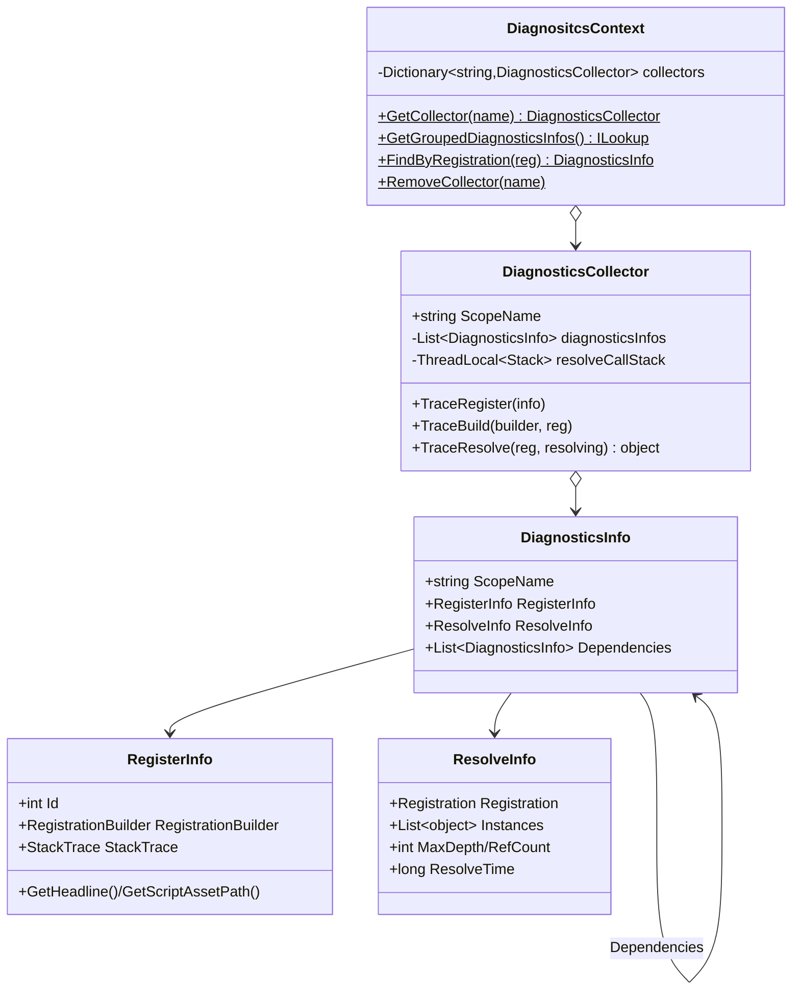
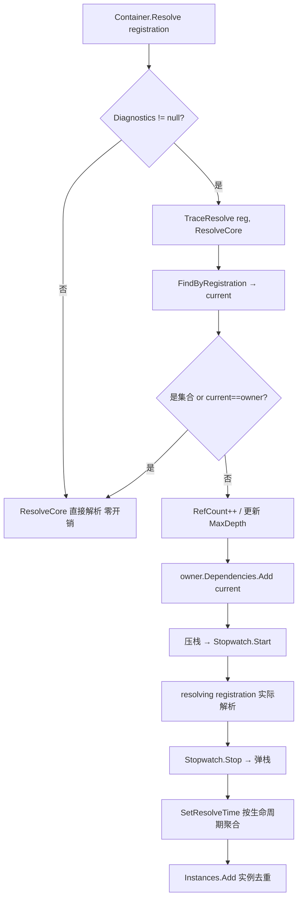
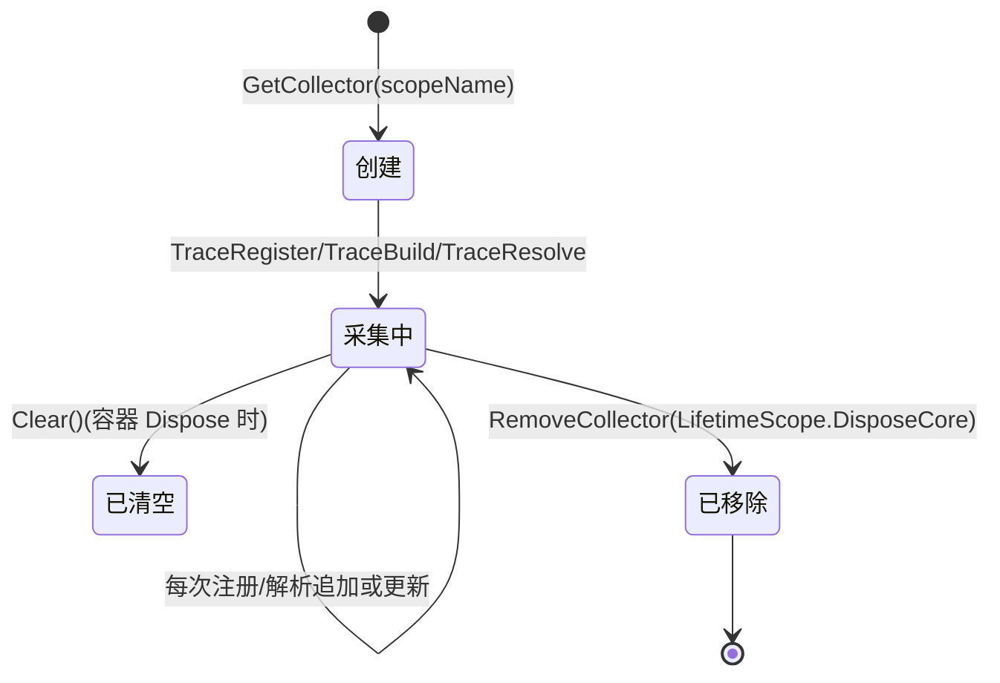

# M7 诊断可观测层 · 解析

> 坐标：注入点 / 旁路层。依赖 M3（RegistrationBuilder/Registration）、M4（解析时被回调）；被 Editor 诊断窗口（`VContainerDiagnosticsWindow`，未深入解析）消费。
> 职责：在**不改变解析逻辑**的前提下，旁路采集"谁注册了什么（带源码位置）/谁解析了谁（带耗时/引用计数/依赖树）"，供编辑器可视化。是典型的「快照可观测 + 零侵入注入点」设计。

---

## 一、契约定义

### 核心类型清单

| 文件 | 角色 | 可见性 |
|---|---|---|
| `DiagnosticsCollector` | 单作用域的采集器：Trace 注册/构建/解析 | `public sealed` |
| `DiagnositcsContext`(注意拼写) | 全局静态注册表：按 scopeName 管理所有 Collector | `public static` |
| `DiagnosticsInfo` | 一条诊断记录：RegisterInfo + ResolveInfo + 依赖子节点 | `public sealed` |
| `RegisterInfo` | 注册快照：自增 Id + RegistrationBuilder + 注册处 StackTrace | `public sealed` |
| `ResolveInfo` | 解析快照：Registration + 实例列表 + 深度/引用数/耗时 | `public sealed` |

### 穿透语法的关键设计约束

1. **采集是"可空开关"，热路径零成本**：M4 容器的 `Resolve`/`ContainerBuilder.Register` 全部以 `Diagnostics?.Xxx(...)` 形式调用。`DiagnosticsCollector` 只在 `VContainerSettings.DiagnosticsEnabled` 时由 `LifetimeScope.Build` 注入（否则为 null）。关闭时 `?.` 短路，无任何采集开销——这是"可观测但默认不付费"的核心。
2. **注册位置用 `StackTrace` 抓取并定位到用户代码**：`RegisterInfo` 构造时 `new StackTrace(true)`，`GetHeadlineFrame` 跳过命名空间以 `VContainer` 开头的帧，找到**第一个用户代码帧**作为"这条注册写在哪一行"。`GetScriptAssetPath` 再裁出 `Assets/` 相对路径，供编辑器点击跳转。
3. **TraceBuild 把 Builder 与最终 Registration 关联**：注册时只有 `RegistrationBuilder`（`TraceRegister`）；`BuildRegistry` 后用 `TraceBuild(builder, registration)` 在已有 `DiagnosticsInfo` 列表里按 `RegisterInfo.RegistrationBuilder == builder` 找到对应项，回填 `ResolveInfo`。这是"声明态→构建态"的快照衔接。
4. **TraceResolve 用 ThreadLocal 调用栈重建依赖树 + 统计**：`resolveCallStack`(ThreadLocal Stack) 维护当前解析链。每次解析：找到该注册的 `DiagnosticsInfo`(current)、取栈顶为 owner、`RefCount++`、更新 `MaxDepth`、`owner.Dependencies.Add(current)` 织入依赖树、压栈 → 计时 `resolving(registration)` → 弹栈 → 记录耗时。集合 Provider 跳过（避免噪声）。
5. **耗时按生命周期用不同聚合**：`SetResolveTime`——Transient 用**移动平均**(`(t*(n-1)+elapsed)/n`)，Singleton/Scoped 用**最大值**（只构造一次，取最慢那次）。这反映两类生命周期不同的性能语义。
6. **全局表用 scopeName 字符串作键**：`DiagnositcsContext.collectors` 是 `Dictionary<string, DiagnosticsCollector>`，键是 `LifetimeScope` 的 `scopeName`（含 InstanceID/EntityId）。`GetGroupedDiagnosticsInfos` 过滤 `MaxDepth <= 1`（只展示顶层注册，依赖项作为子节点嵌套展示）。

### Mermaid 类图

---

## 二、生命周期与内存

### 动词语义表

| 操作 | 做什么 | 分配? | 线程安全 |
|---|---|---|---|
| `GetCollector(name)` | 取/建作用域采集器 | 首次建 | `lock(collectors)` |
| `TraceRegister(info)` | 加一条 DiagnosticsInfo（仅注册态） | 是 | `lock(diagnosticsInfos)` |
| `TraceBuild(builder, reg)` | 按 builder 找回填 ResolveInfo | 否 | `lock` |
| `TraceResolve(reg, resolving)` | 包裹实际解析，统计耗时/计数/依赖树 | Stopwatch | ThreadLocal 栈 |
| `NotifyContainerBuilt` | 触发 `OnContainerBuilt` 事件 | — | — |
| `Clear()` | 清空本采集器记录 | — | `lock` |
| `RemoveCollector(name)` | 作用域销毁时移除（LifetimeScope.DisposeCore） | — | `lock` |

### 一次被诊断包裹的解析

### Collector 的生命周期状态机

---

## 三、跨层桥接

- **M3→M7**：`ContainerBuilder.Register` 内 `Diagnostics?.TraceRegister(new RegisterInfo(builder))`；`BuildRegistry` 内 `Diagnostics?.TraceBuild(builder, registration)`。注入点完全在容器构建流程里，靠 `?.` 开关。
- **M4→M7**：`Container.Resolve(Registration)` / `ScopedContainer.Resolve(Registration)` 在 `Diagnostics != null` 时把 `ResolveCore` 作为委托传给 `TraceResolve(registration, ResolveCore)`——**把"实际解析逻辑"作为参数注入采集器**，采集器在其前后织入统计。这是"装饰器 + 委托注入"的旁路织入。
- **M5→M7**：`LifetimeScope.Build` 在 `VContainerSettings.DiagnosticsEnabled` 时 `builder.Diagnostics = DiagnositcsContext.GetCollector(scopeName)`；`DisposeCore` 时 `RemoveCollector(scopeName)`。
- **跨层 DTO 快照**：`RegisterInfo`/`ResolveInfo`/`DiagnosticsInfo` 三者构成可被编辑器只读消费的快照树。`Dependencies` 列表把解析期重建的依赖关系定格为可视化树。`ILookup<scopeName, DiagnosticsInfo>` 是对外暴露的分组视图。
- **事件 Hook**：`DiagnositcsContext.OnContainerBuilt` 让编辑器窗口在容器建好时刷新。

---

## 四、落地难点（脱离框架仿写时最有价值的 3 点）

1. **零成本旁路的 `?.` 开关哲学**：可观测层最忌"开了诊断才对、关了就改行为"。VContainer 把所有采集点写成 `Diagnostics?.Xxx`，且 `TraceResolve` 把真实解析委托 `Func<Registration,object>` 透传——关闭时一行短路、开启时行为完全等价（只多了计时/记录）。仿写任何 profiler/tracer 都应坚持这个不变量。
2. **解析依赖树的运行时重建**：靠 `ThreadLocal<Stack<DiagnosticsInfo>>` 在递归解析中维护"当前解析链"，进入时 `owner.Dependencies.Add(current)` + 压栈、退出弹栈，就地织出一棵依赖树，无需静态分析。难点：要正确处理"重复解析同一注册"（RefCount/Instances 去重）、"集合 Provider 跳过避免噪声"、"current==owner 时跳过自引用"。
3. **注册源码定位的 StackTrace 启发式**：`new StackTrace(true)` 抓栈、跳过 VContainer 命名空间帧找"用户写注册的那一行"。难点是 ① 性能（仅诊断开启时付费）、② 兜底（拿不到文件名时降级，`NotSupportedException`/`SecurityException` 后关闭文件名显示）、③ IL2CPP/Release 下符号缺失的容错。仿写编辑器工具时这是"点击跳转到注册代码"的关键，但要把它严格限制在诊断模式。
