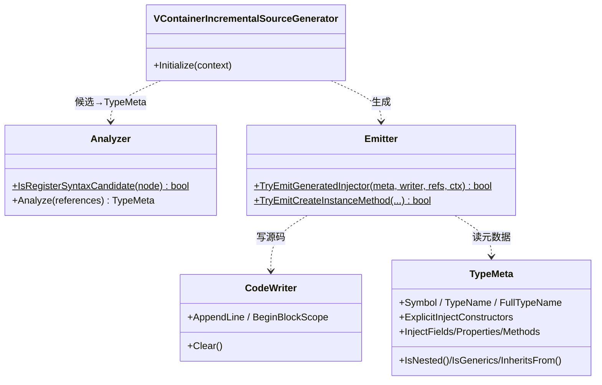
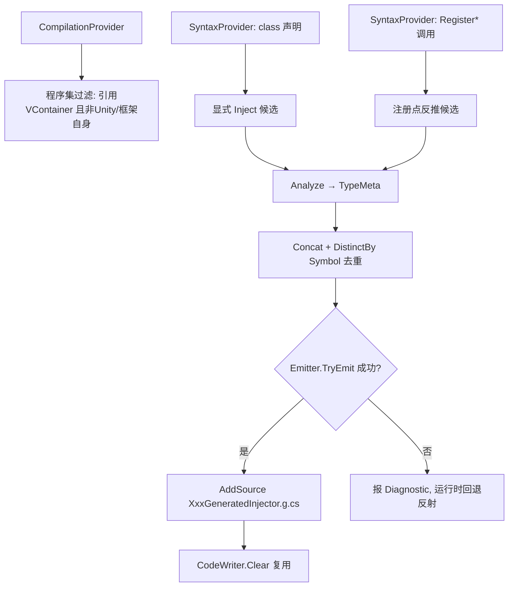
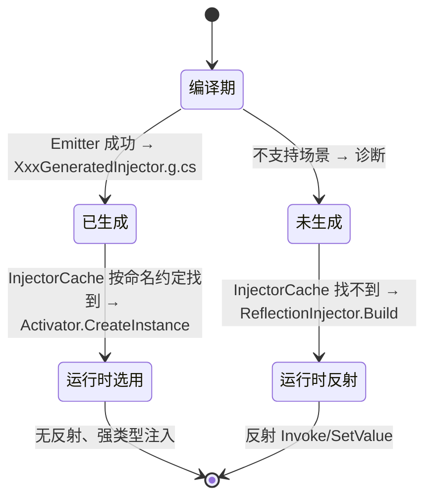

# M8 编译期源生成器 · 解析

> 坐标：注入点（编译期）。独立项目 `VContainer.SourceGenerator`（Roslyn `IIncrementalGenerator`），编译期运行，不进运行时程序集。它产出的 `XxxGeneratedInjector` 在运行时被 M2 的 `InjectorCache` 优先选用，从而**替代反射注入**。
> 职责：在编译期扫描需要注入的类型，为每个类型生成实现 `IInjector` 的强类型类，把"运行时反射 `Invoke`/`SetValue`"变成"编译期 `new T(...)` + 直接字段赋值"。

---

## 一、契约定义

### 核心类型清单

| 文件 | 角色 | 可见性 |
|---|---|---|
| `VContainerIncrementalSourceGenerator` | 增量生成器入口：定义扫描→分析→生成管线 | `public [Generator]` |
| `Analyzer` | 语法候选判定 + 把候选分析为 `TypeMeta`（未深入逐行解析） | static |
| `TypeMeta` | 类型的注入元数据：构造/字段/属性/方法 + 标志（未逐行解析全部） | class |
| `Emitter` | 把 `TypeMeta` 生成为 `IInjector` 源码 + 发诊断 | static |
| `CodeWriter` | 带缩进/块作用域的 StringBuilder 包装 | public |
| `ReferenceSymbols` | 缓存 VContainer 关键符号（KeyAttribute、UnityEngine.Component 等） | （未深入解析） |
| `DiagnosticDescriptors` | 不支持场景的诊断（私有成员/嵌套/泛型等） | （未深入解析） |

> 说明：本模块我**逐行精读了 `Emitter.cs`、`VContainerIncrementalSourceGenerator.cs`、`CodeWriter.cs`**；`Analyzer.cs`/`TypeMeta.cs`/`ReferenceSymbols.cs`/`DiagnosticDescriptors.cs` **未逐行通读**，相关结论标注「未在本仓库逐行验证」。

### 穿透语法的关键设计约束

1. **生成的注入器与反射注入器实现同一 `IInjector` 契约**：`Emitter.TryEmitGeneratedInjector` 生成 `class XxxGeneratedInjector : global::VContainer.IInjector`，含 `CreateInstance` 与 `Inject` 两方法——与 M2 `ReflectionInjector` 完全同形。运行时 `InjectorCache` 按 `{FullName}GeneratedInjector` 命名约定查找并 `Activator.CreateInstance` 它。**命名约定是连接编译期与运行时的隐式契约**。
2. **数据流与反射版完全一致**：生成代码里每个依赖都是 `resolver.ResolveOrParameter(typeof(T), "name", parameters, key)`（见 `EmitMemberInjection`/`GenerateParameterInjectionCode`）——与 M2 反射版调用的是同一个 M4 扩展方法。区别仅在"如何拿到/赋值"：反射用 `Invoke/SetValue`，生成版用 `new T(...)` 和 `__x.field = (T)...`。
3. **增量管线有两条候选来源**：① 显式 `[Inject]` 的 class 声明（`typeDeclarations`）；② `Register*` 调用点涉及的类型（`registerInvocations`，从 DI 注册语句反推要注入哪些类型）。两条流 `Concat` 后按 `Symbol` 去重（`DistinctBy`），保证一个类型只生成一次。
4. **程序集过滤：只为引用了 VContainer 的用户程序集生成**：管线开头 `vcontainerReferenceValueProvider` 排除 VContainer 自身（非 Test）、UnityEngine.*/Unity.* 程序集，且要求引用了 VContainer。避免给框架/引擎程序集生成无用注入器。
5. **不支持场景在编译期报诊断并跳过**：`Emitter` 对嵌套类型、抽象类、泛型类型、私有字段/属性/方法/构造、多 `[Inject]` 构造、泛型方法等**报 `DiagnosticDescriptors` 并返回 false**（不生成）。运行时这些类型自然回退到反射注入（`InjectorCache` 找不到生成类型→ReflectionInjector）。这是"编译期尽力、运行时兜底"的分层容错。
6. **Unity Component 生成 `throw NotSupportedException` 的 CreateInstance**：`TypeMeta.InheritsFrom(UnityEngineComponent)` 时，`CreateInstance` 直接生成抛异常体——Component 不能 `new`，只能 `Inject`（对已存在实例注入）。与 M2/M5 对 Component 的处理一致。
7. **构造选择镜像反射版**：`TryEmitCreateInstanceMethod`——多 `[Inject]` 构造报错；否则取唯一 `[Inject]` 构造，再否则取参数最多的公开构造，再否则隐式无参构造，都没有则报 `ConstructorNotFound`。与 M2 `TypeAnalyzer` 的启发式一致（编译期 ↔ 运行时对称）。

### Mermaid 类图

---

## 二、生命周期与内存（编译期视角）

> 本模块"生命周期"是**编译期管线**，无运行时内存分配（生成的是源码文本）。

### 动词语义表

| 操作 | 做什么 | 时机 |
|---|---|---|
| `Initialize` | 注册增量管线（过滤+两条候选流+生成输出） | 编译器加载生成器时 |
| `vcontainerReferenceValueProvider` | 判定当前程序集是否需生成 | 每次编译（增量缓存） |
| `Analyze(references)` | 候选语法 → `TypeMeta` | 候选变化时 |
| `Emitter.TryEmitGeneratedInjector` | TypeMeta → IInjector 源码（或报诊断返回 false） | 生成阶段 |
| `AddSource(name, code)` | 注入 `{Type}GeneratedInjector.g.cs` 到编译 | 生成阶段 |
| `CodeWriter.Clear` | 复用同一 writer 生成下一个类型 | 每类型后 |

### 编译期生成管线

### 编译期生成 ↔ 运行时选用的对接

---

## 三、跨层桥接

- **M8→M2（运行时选用点）**：`InjectorCache.GetOrBuild` 的第一分支 `key.Assembly.GetType($"{key.FullName}GeneratedInjector")`——**命名约定 `{FullName}GeneratedInjector` 是编译期与运行时的唯一契约**。生成器按这个名字产类，运行时按这个名字找类。
- **M8→M4（数据流复用）**：生成的 `CreateInstance`/`Inject` 体内调用 `resolver.ResolveOrParameter(...)`，复用 M4 的同一解析门面。因此切换"反射↔源生成"对解析语义零影响。
- **跨层 DTO 快照**：`TypeMeta` 是编译期的注入计划快照（对应运行时 `InjectTypeInfo`）。两者是同一概念在编译期/运行时的两个实现，承载相同信息（构造/字段/属性/方法 + Key）。
- **诊断反馈**：`DiagnosticDescriptors` 在编译期把"不支持的注入写法"作为编译警告/错误反馈给用户（IDE 红线），是比运行时异常更早的反馈通道。

---

## 四、落地难点（脱离框架仿写时最有价值的 3 点）

1. **编译期与运行时的对称性约束**：生成器的构造选择/成员扫描/Key 抽取必须与运行时反射版**逐条对称**（同样的"[Inject] 优先→参数最多"、同样的继承链去重、同样的 `ResolveOrParameter` 调用形态）。任何不对称都会导致"开/关源生成行为不一致"。仿写时这是最难维持的——要把 M2 的运行时启发式在 Roslyn 符号层面再实现一遍。
2. **"能生成就生成、不能就回退"的分层容错**：源生成器不可能覆盖所有 C# 写法（私有成员、嵌套、泛型）。设计上必须保证**未生成的类型在运行时无缝回退反射**，且回退是隐式的（靠 `InjectorCache` 命名约定 miss → ReflectionInjector）。仿写时若让"未生成"变成运行时崩溃，就破坏了体验。诊断要在编译期把不支持原因说清楚。
3. **增量管线的正确性与去重**：两条候选来源（显式 `[Inject]` 声明 + `Register*` 调用点反推）要 `Concat + DistinctBy(Symbol)`，否则同类型生成两次导致重复类名编译失败；程序集过滤要精确（排除自身/引擎、只处理引用方），否则给无关程序集生成垃圾。`IIncrementalGenerator` 的 Provider 组合（`Combine`/`Where`/`Select`/`Collect`）要利用增量缓存避免全量重算——这是 Roslyn 源生成的工程难点。
