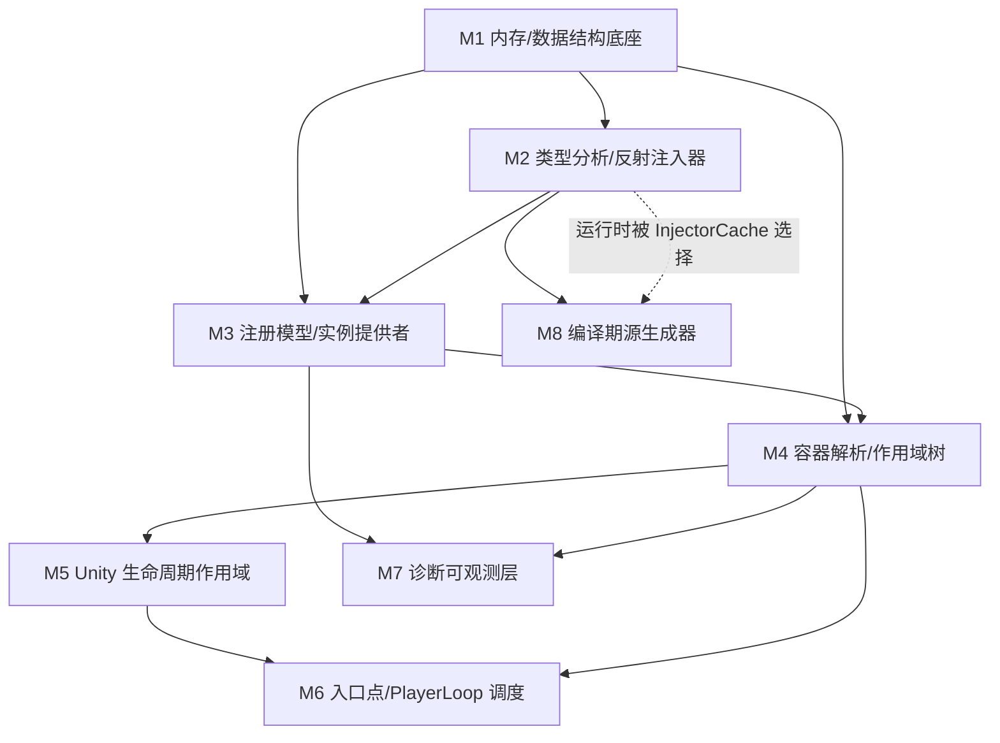

# VContainer 架构反向工程解析 · 总索引

> 目标：通过逐模块的「契约 / 生命周期 / 内存 / 跨层数据流」三维穿透，把 VContainer 的设计内化到可以脱离框架仿写的程度。
>
> 解析对象：`VContainer/Assets/VContainer/Runtime/`（运行时核心 + Unity 包装层）与 `VContainer.SourceGenerator/`（编译期注入器）。
>
> 所有论断均基于实际阅读的源码。凡基于通用知识补充、未在本仓库逐行验证之处，均显式标注「未在本仓库验证」。

---

## 1. 模块清单表

| 模块 | 层 | 目录/关键文件 | 一句话职责 |
|---|---|---|---|
| **M1 内存复用与数据结构底座** | 核心 | `Internal/CappedArrayPool` `FreeList` `ListPool` `FixedTypeObjectKeyHashtable` `TypeKeyHashTable2` `CompositeDisposable` `RuntimeTypeCache` | 提供零/低 GC 的数组租借、可迭代安全增删的空闲表、只读完美哈希表 |
| **M2 类型分析与反射注入器** | 核心 | `Internal/TypeAnalyzer` `ReflectionInjector` `InjectorCache` `InjectParameter`、`IInjector` | 把一个类型解析为「构造/字段/属性/方法」注入计划并执行注入 |
| **M3 注册模型与实例提供者** | 核心 | `Registration` `RegistrationBuilder` `Registry`、`Internal/InstanceProviders/*` | 声明「契约→实现+生命周期」，并为每种来源提供 `SpawnInstance` 策略 |
| **M4 容器解析与作用域树** | 核心 | `Container` `ContainerBuilder` `IObjectResolverExtensions` `ContainerLocal` | 按生命周期解析实例、维护父子作用域链与释放栈 |
| **M5 Unity 生命周期作用域** | 包装 | `Unity/LifetimeScope(.AwakeScheduler)` `ParentReference` `VContainerSettings` `IInstaller` | 把容器绑定到 MonoBehaviour 的 Awake/OnDestroy 生命周期 |
| **M6 入口点与 PlayerLoop 调度** | 包装 | `Unity/EntryPointDispatcher` `PlayerLoopHelper` `PlayerLoopRunner` `PlayerLoopItem`、`Annotations/*` | 把 DI 对象挂入 Unity 主循环各阶段并容错执行 |
| **M7 诊断可观测层** | 注入点 | `Diagnostics/DiagnosticsCollector` `DiagnosticsContext` `DiagnosticsInfo` | 旁路采集注册/解析快照，零侵入支撑编辑器窗口 |
| **M8 编译期源生成器** | 注入点 | `VContainer.SourceGenerator/Emitter` 等 | 在编译期生成 `IInjector`，替代运行时反射 |

## 2. 依赖关系图

## 3. 进度勾选表

- [x] M1 内存复用与数据结构底座
- [x] M2 类型分析与反射注入器
- [x] M3 注册模型与实例提供者
- [x] M4 容器解析与作用域树
- [x] M5 Unity 生命周期作用域
- [x] M6 入口点与 PlayerLoop 调度
- [x] M7 诊断可观测层
- [x] M8 编译期源生成器
- [x] 跨模块设计主线（母题提炼）

每个模块产出三件套，位于 `docs/{模块名}/`：
1. `01_{模块}_解析.md` —— 契约 / 生命周期与内存 / 跨层桥接 / 落地难点 / 坐标
2. `02_{模块}_Facade仿写.md` —— 设计映射表 + 最小可编译复刻 + 用法 + 取舍自检
3. `03_{模块}_考题.md` —— 概念/机制/陷阱/实操题（含折叠答案）

---

## 4. 跨模块设计主线 / 母题（从"懂模块"到"懂架构"）

读完 8 个模块后，下面这些设计模式在多个模块里反复出现。把它们当作 VContainer 的"架构语法"，比记 API 重要得多。

### 母题 1 · 复用机制：分析一次、解析多次的"不可变快照"
- **M1** `FixedTypeObjectKeyHashtable` 构建后冻结只读；**M2** `InjectTypeInfo`（注入计划）/`InjectorCache` 缓存；**M3** `Registration` 不可变；**M8** `TypeMeta` 是 `InjectTypeInfo` 的编译期镜像。
- 统一规律：**凡是"算一次能用很多次"的东西，都做成不可变并缓存（`ConcurrentDictionary.GetOrAdd`）**。这把成本压到构建期，让解析热路径只读、无锁、可并发。

### 母题 2 · 复用机制：对象池 + try/finally 配对
- **M1** `CappedArrayPool`(参数数组) / `ListPool`(临时缓冲) / `RuntimeTypeCache`(派生类型)。
- **M2/M3** 反射 invoke 与 ContainerLocal 用 `Shared8Limit.Rent/Return`；**M3/M5/M6** 集合聚合、场景查找、Awake 调度用 `ListPool.Get(out buf)`。
- 统一规律：**热路径不 new，借还成对**。`BufferScope`/`using` 把归还自动化，降低"忘记 Return"风险。

### 母题 3 · 注入点：策略接口 + 命名/委托替换
- `IInstanceProvider`(M3，实例从哪来)、`IInjector`(M2/M8，怎么注入)、`IInstaller`(M5，怎么装配)、`IInjectParameter`(M2，覆盖参数)、`IPlayerLoopItem`(M6，怎么 tick)。
- 最精彩的注入点：**`InjectorCache` 用命名约定 `{Type}GeneratedInjector` 让编译期产物（M8）无缝替换运行时反射（M2）**，二者数据流经同一 `ResolveOrParameter` 完全对称。
- 统一规律：**用窄接口隔离"做什么"与"怎么做"，让实现可在编译期/运行时、反射/生成、Unity/纯 C# 之间替换**。

### 母题 4 · 迭代安全增删：原位 null + 标志位延迟移除
- **M1** `FreeList` 删除只原位 null、索引稳定；**M6** `PlayerLoopRunner.Run` 按固定快照长度遍历、`MoveNext` 返回 false 才 `RemoveAt`，Dispose 只置 `disposed` 靠下帧出列。
- 统一规律：**"正在遍历的集合"的删除要收敛到遍历者自身、且不搬移元素**，避免并发修改异常与漏/重执行。

### 母题 5 · 快照可观测：旁路织入 + `?.` 零成本开关
- **M7** 全部采集点 `Diagnostics?.Xxx`，`TraceResolve(reg, ResolveCore)` 把真实逻辑作委托透传；**M6** LoopItem 容错把异常 `Publish` 给可空 handler；**M3/M4** Diagnostics 在容器构建/解析流程里以可空旁路存在。
- 统一规律：**可观测/容错层默认零成本、开启不改变被观测行为**（委托透传 + 可空短路）。

### 母题 6 · 组合派生：声明少、解析时自动合成
- **M3** 多注册自动派生 `CollectionInstanceProvider`、开放泛型即时合成封闭 `Registration`、`ContainerLocal<T>` 回退、单元素集合回退；**M4** `IObjectResolver` 自注册。
- 统一规律：**用户只声明最小集合，容器在 `TryGet` miss 时按规则即时派生并缓存**，把"组合/泛型/集合"的复杂度藏在解析回退里。

### 母题 7 · 存储键设计：用引用哈希与不可变引用作键
- **M1/M3** `RuntimeHelpers.GetHashCode(type)` 绕过用户重写、`(Type,object)` 复合键支持 Keyed；**M4** 用 `Registration` 引用作 `sharedInstances` 字典键（不可变可共享 → 跨作用域命中同一单例）；**M7** 用 `scopeName` 字符串作全局采集器键。
- 统一规律：**键的"稳定性"决定缓存的"确定性"**。Registration 不持实例正是为了能安全作键。

### 母题 8 · 状态机：层级路由 + 时序兜底
- **M4** 单例"归属声明层"的向上路由；**M5** 父作用域定位的 6 级优先级链 + 父未就绪的"等待队列 + 异常重试 + 唤醒"；**M6** 入口点一次性/持续性的 `MoveNext` 状态机。
- 统一规律：**用显式优先级链表达"从哪找"，用等待/重试兜底"还没就绪"的时序竞态**，不靠隐式假设顺序。

### 母题 9 · 容错策略：分层降级，功能永远可用
- **M2/M8** 源生成不支持 → 编译诊断 + 运行时回退反射；**M6** 入口点异常 → handler.Publish（默认 LogException）不中断主循环；**M5** 父找不到 → 入等待队列而非崩溃；**M7** StackTrace 取不到文件名 → 降级显示。
- 统一规律：**优化路径失败时优雅降级到正确但慢/简的路径，绝不让"增强功能缺失"变成"基本功能崩溃"**。

### 一句话总纲
> VContainer 的架构本质 = **构建期把一切算成不可变快照并冻结（确定性 + O(1) 查表）+ 解析期只读无锁地按生命周期路由（性能）+ 用窄接口/命名约定让反射、源生成、Unity 绑定、诊断都成为可插拔/可旁路/可降级的注入点（可扩展 + 韧性）**。

---

### 文档完成情况
8/8 模块三件套 + 总索引 + 母题提炼，全部基于实际阅读的源码产出。未逐行通读的文件（源生成器的 `Analyzer/TypeMeta/ReferenceSymbols/DiagnosticDescriptors`、Editor 诊断窗口、ECS/World 集成、UniTask 集成）已在相应文档显式标注「未在本仓库逐行验证」。
